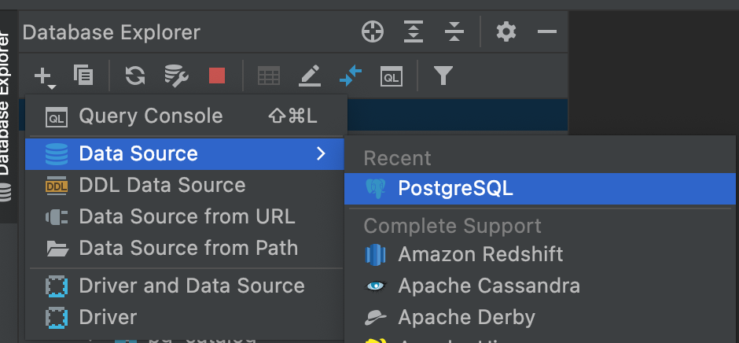
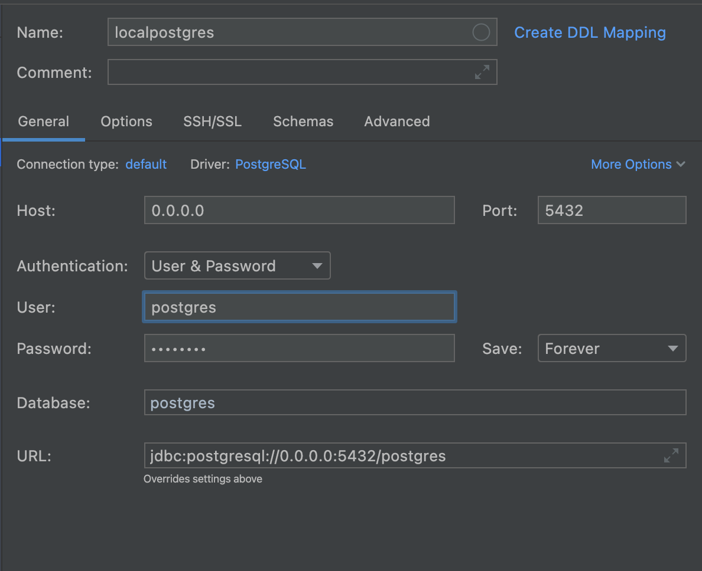
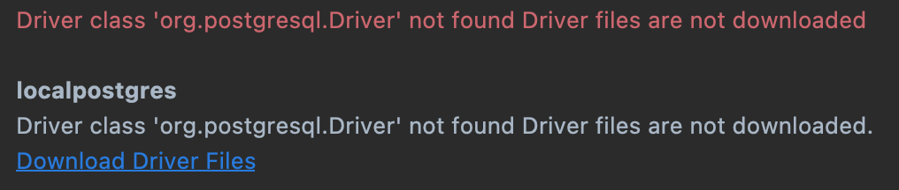
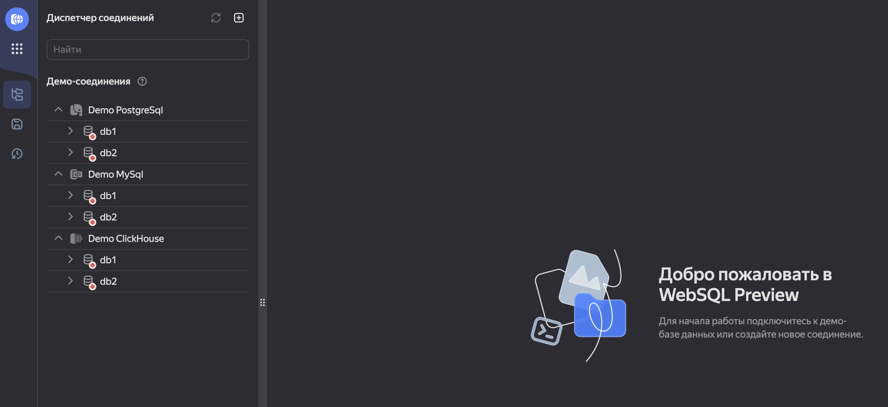
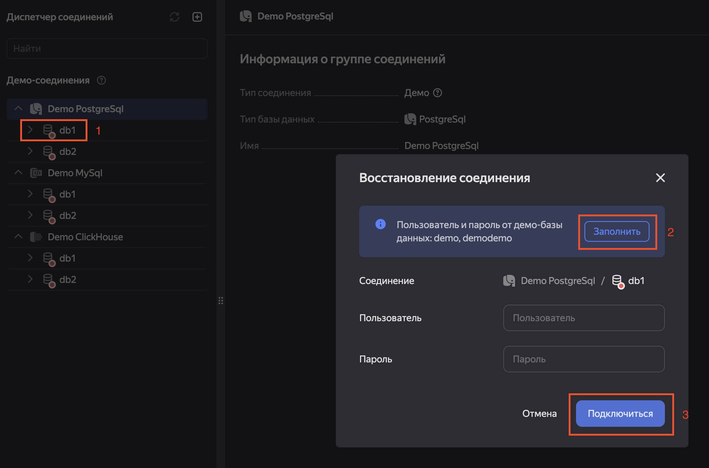
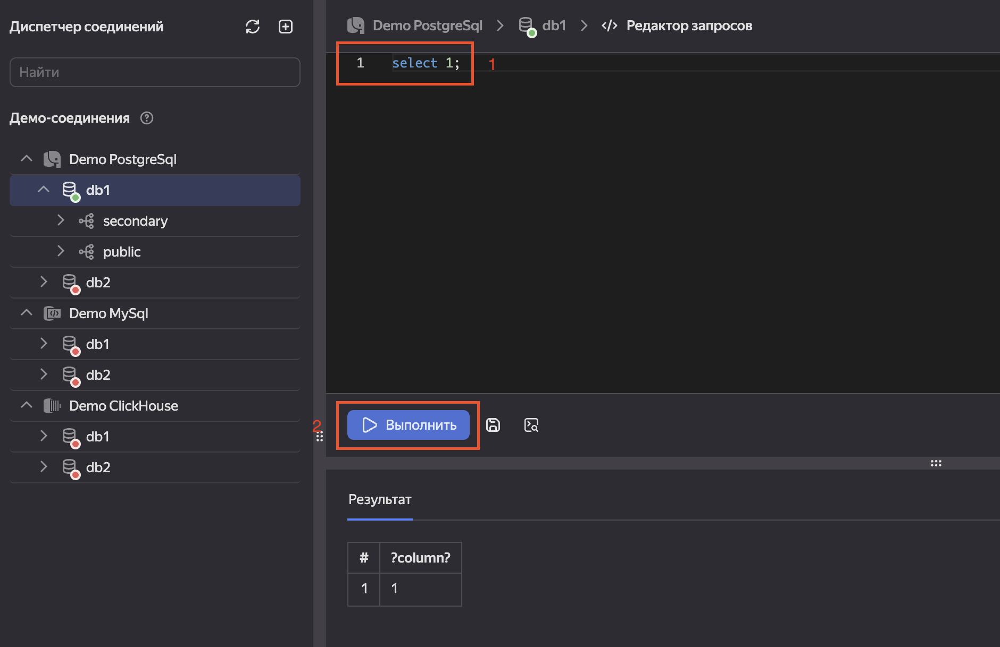
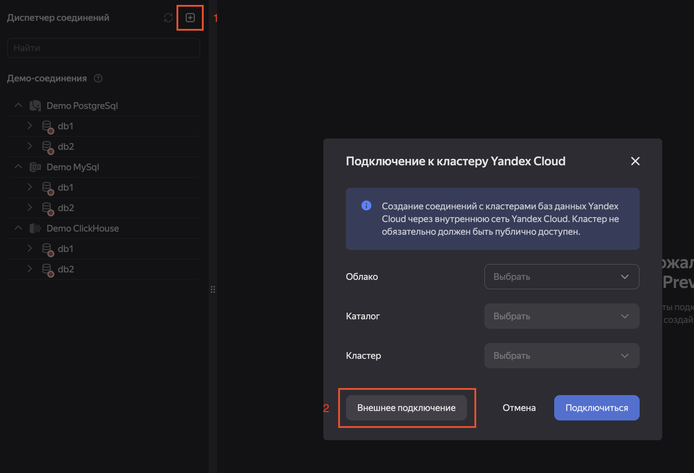

# Как накатить PostgreSQL локально?

1. Качаем и устанавливаем
   [DataGrip](https://www.jetbrains.com/datagrip/download/) или
   [DBeaver](https://dbeaver.io/download/)
2. Скачиваем и устанавливаем docker (и по всей видимости docker-compose в случае
   ubuntu):
   - [docker windows](https://docs.docker.com/desktop/windows/install/)
   - [docker mac os](https://docs.docker.com/desktop/mac/install/)
   - [docker ubuntu](https://docs.docker.com/engine/install/ubuntu/) +
     [docker-compose](https://docs.docker.com/compose/install/)
3. Создаем отдельную папку, где будет все необходимое для работы, внутри создаем
   пустую папку data и файл docker-compose.yml со следующим содержанием

   ```yaml
   version: "3.9"
   services:
     postgres:
       image: postgres:latest
       environment:
         POSTGRES_DB: "postgres"
         POSTGRES_USER: "postgres"
         POSTGRES_PASSWORD: "postgres"
         PGDATA: "/var/lib/postgresql/data/pgdata"
       volumes:
         - ./data:/var/lib/postgresql/data
       ports:
         - "5432:5432"
   ```

4. Из корня папки, которую мы создали, вызываем команду

   ```yaml
   docker-compose up --build -d
   ```

   В результате у нас должен появиться рабочий postgres. Убедитесь в том, что
   никакой другой postgres не запущен, а также проверьте отсутствие русских букв
   в пути до текущей директории

5. Заходим в DataGrip (ниже скриншоты из него) или DBeaver, создаем проект, и
   теперь подключаемся к postgres:
   - Создаем Data Source PostgreSQL:
     
   - Прописываем четыре нуля в host, в полях user, password, database
     прописываем `postgres`, после этого сохраняем конфигурацию
      **Примечание:**
     - Вы можете в п.3 до запуска контейнера задать другие креды в разделе
       `environment`, тогда и при подключении к БД нужно использовать их.
     - Вы таким же образом можете подключаться к удаленной (от remote, а не
       deleted) БД при наличии кредов: хоста, имени юзера, пароля и пр. Это мы
       опробуем на семинаре.
   - В случае возникновения ошибки ниже необходимо кликнуть на
     `Download Driver Files` и попробовать подключиться повторно.
     

# Как подключиться к БД через [Yandex WebSQL](https://cloud.yandex.ru/ru/docs/websql/)?

[Полная инструкция](https://cloud.yandex.ru/ru/docs/websql/quickstart)

Инструкция коротко:

1. Заведите аккаунт в Yandex Cloud. Так как сервис в стадии preview, плата за
   использование взиматься не должна.
2. Перейдите в сервис [WebSQL](https://websql.cloud.yandex.ru/) и авторизуйтесь.
   У вас должны стать видны демо-подключения:
   
3. Подключитесь к базе Demo Postgresql:
   
4. Введите в консоли запрос `select 1;` и нажмите `Выполнить`. Ниже должна
   появиться таблица с результатом: 
5. Чтобы подключиться по кредам к удаленной базе, нажмите на
   `Добавить соединение` и `Внешнее подключение`:
   
6. Введите креды, которые вам предоставили.
