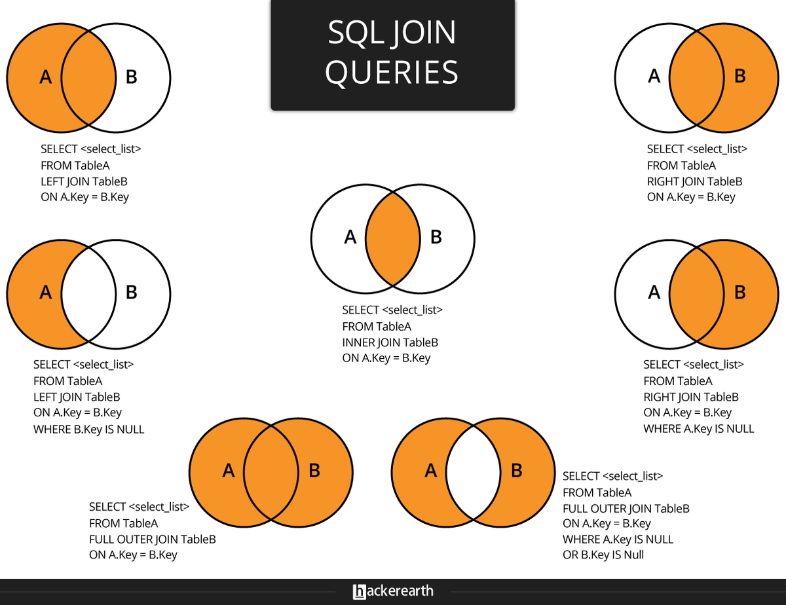
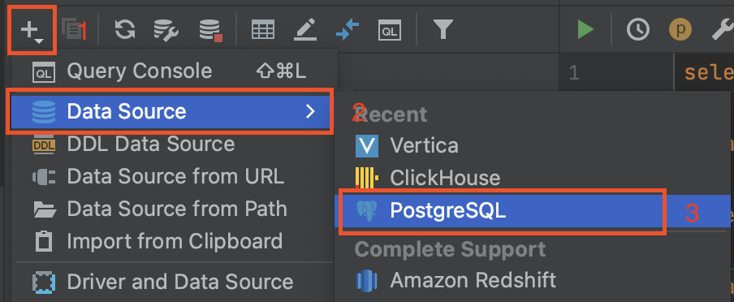
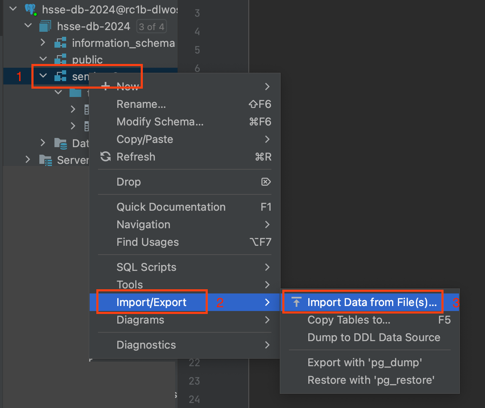

# Материалы

- [Лекция 2](https://drive.google.com/file/d/1uIZJnx5Jf9L0EcLXKxvBsYhcdMJ8gVgP/view?usp=sharing)
- [Don't Do This](https://wiki.postgresql.org/wiki/Don't_Do_This) – список частых ошибок при написании запросов и прочих взаимодействиях с БД.
- [PostgreSQL Data Types](https://www.postgresql.org/docs/current/datatype.html)
- [Дока по условным выражениям](https://postgrespro.ru/docs/postgresql/9.5/functions-conditional)

# Теория

## Введение

**SQL (Structured Query Language)** – декларативный язык программирования, применяемый для создания, модификации и управления данными в реляционной БД, управляемой соответствующей СУБД.

**Группы операторов SQL:**

1. *DDL (Data Definition Language)* – создание объектов БД, их модификация и удаление.
2. *DML (Data Manipulation Language)* – добавление, удаление и модификация _данных_ в БД.
3. *DCL (Data Control Language)* – осуществления административных операций.
4. *TCL (Transaction Control Language)* – управление транзакциями.

В рамках этого семинара более подробно рассматриваем группы DDL и DML.

## Операторы SQL

### Операторы определения данных (Data Definition Language)

1. `CREATE` – создание объектов БД
```sql
CREATE [TEMPORARY] TABLE [IF NOT EXISTS] tbl_name(
    col_name_1   datatype_1,
    col_name_2   datatype_2,
    ...
    col_name_N   datatype_N
);
```

2. `ALTER` – модификация объектов БД
```sql
ALTER TABLE table_name ADD column_name datatype;
ALTER TABLE table_name DROP column_name;
ALTER TABLE table_name RENAME column_name TO new_column_name;
ALTER TABLE table_name ALTER column_name TYPE datatype;
...
```

3. `DROP` – удаление объектов БД 
```sql
DROP TABLE [IF EXISTS] table_name;
```

4. `TRUNCATE` – удаление содержимого объекта БД (данные удаляются целым куском, нельзя удалять по условию)
```sql
TRUNCATE TABLE table_name;
```

### Операторы манипуляции данными (Data Manipulation Language)

1. `SELECT` – выбирает данные, удовлетворяющие заданным условиям
2. `INSERT` – добавляет новые данные
```sql
INSERT INTO table_name [(comma_separated_column_names)] VALUES (comma_separated_values);
```

3. `UPDATE` – изменяет (обновляет) существующие данные
```sql
UPDATE table_name
    SET update_assignment_comma_list
WHERE conditional_experssion;
```

4. `DELETE` – удаляет существующие данные (данные удаляются построчно – можно задавать условие, "откатывать" удаление)
```sql
DELETE
    FROM table_name
[WHERE conditional_expression];
```

#### 1.1 Структура запроса

Порядок написания запроса:

```sql
SELECT [DISTINCT] select_item_comma_list -- список столбцов для вывода
FROM table_reference_comma_list -- список таблиц
[WHERE conditional_expression] -- условия фильтрации, можно использовать AND / OR / NOT
[GROUP BY column_name_comma_list] -- условие группировки
[HAVING conditional_expression] -- условие фильтрации после группировки
[ORDER BY order_item_comma_list]; -- список полей, по которым сортируется вывод
```

#### 1.2 Порядок выполнения запроса

Порядок выполнения запроса отличается от порядка его записи, это необходимо помнить:

**FROM <span>&#8594;</span> WHERE <span>&#8594;</span> GROUP BY <span>&#8594;</span> HAVING <span>&#8594;</span> SELECT <span>&#8594;</span> ORDER BY**

####  1.3 Агрегирующие функции
					
При группировке в блоке `SELECT` могут встречаться либо атрибуты, по которым происходит группировка, либо атрибуты, которые подаются на вход агрегирующим функциям. В SQL есть 5 стандартных агрегирующих функций. При выполнении запроса функции не учитывается специальное значение `NULL`, которым обозначается отсутствующее значение.
					
* `count()` – количество записей с известным значением. Если необходимо подсчитать количество уникальных значений, можно использовать `count(DISTINCT field_nm)`
* `max()` - наибольшее из всех выбранных значений поля
* `min()` - наименьшее из всех выбранных значений поля
* `sum()` - сумма всех выбранных значений поля
* `avg()` - среднее всех выбранных значений поля

					 					
#### 1.4 Операции соединения таблиц (JOIN)
					
Операции соединения делятся на 3 группы:
					
* `CROSS JOIN` – декартово произведение 2 таблиц
* `INNER JOIN` – соединение 2 таблиц по условию. В результирующую выборку попадут только те записи, которые удовлетворяют условию соединения
* `OUTER JOIN` – соединение 2 таблиц по условию. В результирующую выборку могут попасть записи, которые не удовлетворяют условию соединения: 
    * `LEFT (OUTER) JOIN` – все строки "левой" таблицы попадают в итоговую выборку
    * `RIGHT (OUTER) JOIN` – все строки "правой" таблицы попадают в итоговую выборку 
    * `FULL (OUTER) JOIN` – все строки обеих таблиц попадают в итоговую выборку



#### 1.5 Полезные функции

Иногда бывает полезно использовать в запросе специальные функции:
* `IN` – принадлежность определенному набору значений:
`X IN (a1, a2, ..., an)` <span>&#8803;</span> X = a<sub>1</sub> or X = a<sub>2</sub> or ... or X = a<sub>n</sub>
* `BETWEEN` – принадлежность определенному интервалу значений:
`X BETWEEN A AND B` <span>&#8803;</span> (X >= A and X <= B) or (X <= A and X >= B)
* `LIKE` – удовлетворение текста паттерну: `X LIKE '0%abc_0'`, где `_` – ровно 1 символ, а `%` – любая последовательность символов (в том числе нулевой длины).
* `IF ... THEN ... [ELSIF ... THEN ... ELSE ...] END IF` – ветвления, **пример**:
```postgresql
SELECT
    IF number = 0 THEN
        'zero'
    ELSIF number > 0 THEN
        'positive'
    ELSIF number < 0 THEN
        'negative'
    ELSE
        'NULL'
    END IF AS number_class
FROM
    numbers
```
* `CASE [...] WHEN ... THEN ... ELSE ... END CASE` – еще один аналог ветвлений, **пример**:
```postgresql
SELECT
    CASE 
        WHEN number = 0 THEN
            'zero'
        WHEN number > 0 THEN
            'positive'
        WHEN number < 0 THEN
            'negative'
        ELSE
            'NULL'
    END CASE AS number_class
FROM
    numbers
```
* `DISTINCT ON` - исключает строки, совпадающие по всем указанным выражениям, **пример**:
```postgresql
-- вывести кол-во уникальных отделов
SELECT
    count(DISTINCT ON department_nm)
FROM
    salary;
```
* `COALESCE(value_list)` – возвращает первый попавшийся аргумент, отличный от NULL. Если же все аргументы равны NULL, результатом также будет NULL. **Пример:**
```postgresql
-- вывести описание каждой книги при наличии, иначе краткое описание, иначе строку 'none'
SELECT
    book_name,
    COALESCE(description, short_description, 'none') as descr
FROM
    book_table;
```
* `GREATEST(value_list)` / `LEAST(value_list)` – возвращает наибольшее или наименьшее значение из списка выражений. Все эти выражения должны приводиться к общему типу данных, который станет типом результата. NULL возвращается только в том случае, если все значения равны NULL. **Пример:**
```postgresql
-- вывести наибольшую и наименьшую оценку по трем предметам
SELECT
    student_name,
    GREATEST(physics_mark, maths_mark, cpp_mark, db_mark) as max_mark,
    LEAST(physics_mark, maths_mark, cpp_mark, db_mark) as min_mark
FROM
    student_marks;
```

#### 1.6 Ключевое слово `WITH`
`WITH` предоставляет способ записывать дополнительные операторы для применения в больших запросах. 
Эти операторы, которые также называют общими табличными выражениями (Common Table Expressions, CTE), 
можно представить как определения временных таблиц, существующих только для одного запроса. 
Более подробно про СТЕ будет на следующих семинарах.
**Пример**:
```postgresql
WITH 
    regional_sales AS (
        SELECT 
            region, 
            SUM(amount) AS total_sales
        FROM 
            orders
        GROUP BY 
            region
    ), 
    top_regions AS (
        SELECT 
            region
        FROM 
            regional_sales
        WHERE 
            total_sales > (SELECT SUM(total_sales)/10 FROM regional_sales)
   )
SELECT 
    region,
    product,
    SUM(quantity) AS product_units,
    SUM(amount) AS product_sales
FROM 
    orders
WHERE 
    region IN (SELECT region FROM top_regions)
GROUP BY 
    region, 
    product;
```

# Практика

Работаем с датасетом Flights and Airports Data, см. [источник](https://www.kaggle.com/datasets/tylerx/flights-and-airports-data?resource=download&select=flights.csv).

<details>
  <summary>Подключение</summary>

1. Для подключения через DataGrip или аналог установите следующий сертификат:
```bash
mkdir -p ~/.postgresql && \
wget "https://storage.yandexcloud.net/cloud-certs/CA.pem" \
    --output-document ~/.postgresql/root.crt && \
chmod 0600 ~/.postgresql/root.crt
```
2. Создайте новый DataSource типа PostgreSQL:

3. В настройках подключения введите переданные семинаристом креды. Во вкладке SSH/SSL отметьте галочкой "Use SSL", в графе "CA file" укажите путь из первого шага: `~/.postgresql/root.crt`.

*Примечание:*
- Студенческая учетная запись не предполагает возможности создавать объекты БД и модифицировать их. Отработка операторов помимо SELECT предполагается в домашней работе и/или локальной БД.
- Данные, используемые на семинаре, выложены на [кагле](https://www.kaggle.com/datasets/tylerx/flights-and-airports-data?resource=download&select=flights.csv) и [гугл-диске](https://drive.google.com/file/d/1zXuS8jMuGbtv7lTXv9Rf4933Uxjwzd0A/view?usp=sharing). Для создания аналогичной локальной бд необходимо:
  - Создать схему: `create schema seminar2;`
  - Импортируйте данные из скачанных csv-файлов в таблицы `airports` и `flights`:



</details>

## Работа на семинаре

### Таблица `seminar_2.airports`
1. Выведите все уникальные города, в которых есть аэропорты.
2. Выведите все уникальные штаты, в которых есть аэропорты, в алфавитном порядке.
3. Выведите уникальные названия всех аэропортов, содержащих подстроку 'International'. Как написать запрос, если есть подозрения, что в каких-то случаях 'International' написано с маленькой буквы?
4. Посчитайте количество аэропортов в каждом штате.
5. Выведите топ-10 штатов по количеству аэропортов в порядке убывания их количества.
6. Выведите все штаты, в которых более 15 аэропортов.
7. Для каждого штата определите, большой он или нет, исходя из количества аэропортов. Большими будем считать штаты, в которых более 25 аэропортов, маленькими – те, в которых их менее 5.
8. Основываясь на результате прошлого задания, ответьте, сколько штатов каждого из заданных размеров.
9. Сколько в среднем аэропортов приходится на штат? Вывести с округлением до 3 знаков после запятой.
10. Вывести все пары (город, аэропорт), где название аэропорта содержит название города.

### Таблица `seminar_2.flights`
1. Вывести наиболее популярный аэропорт прилёта и количество зарегистрированных прилётов.
2. Какие 5 наиболее популярных маршрутов перелёта? Вывести названия аэропорта отбытия и аэропорта прибытия с количеством рейсов.
3. Вывести все уникальные машруты (origin_airport, dest_airport) с перелётами в рамках штата Техас (state = 'TX').
4. Обогатите таблицу перелётов: выведите всю информацию из неё, но вместо номера дня недели – название. Подсказка: воспользуйтесь методом to_char.
5. Через сколько разных штатов можно добраться из Техаса (state = 'TX') в штат Аляска (state = 'AK')?


## Домашняя работа
1. Заведите в локальной базе в соответствии с инструкцией выше подобие семинарской БД.
2. Добавьте в таблицу `seminar_2.airports` поле, указывающее на размер штата (см. задание 7 из семинара)
3. Удалите все перелёты, связанные со штатом 'TX'.
4. Добавьте в таблицу `seminar_2.airports` несколько произвольных строк одним запросом. Часть полей можно оставлять пустыми.
5. Очистите таблицу `seminar_2.flights` полностью.
6. Удалите таблицу `seminar_2.flights`.
7. В таблице `seminar_2.airports` переименуйте колонку `name` на `airport_nm`.