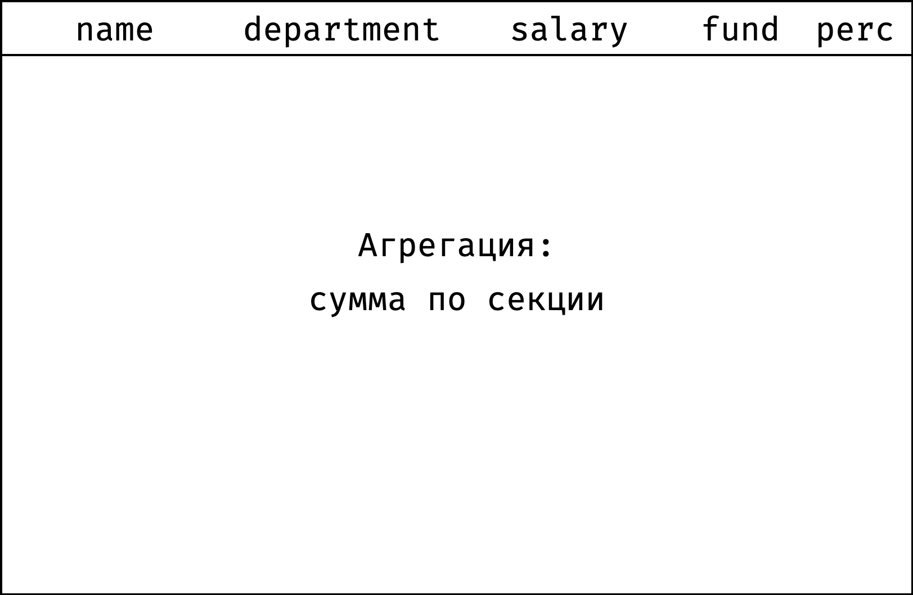
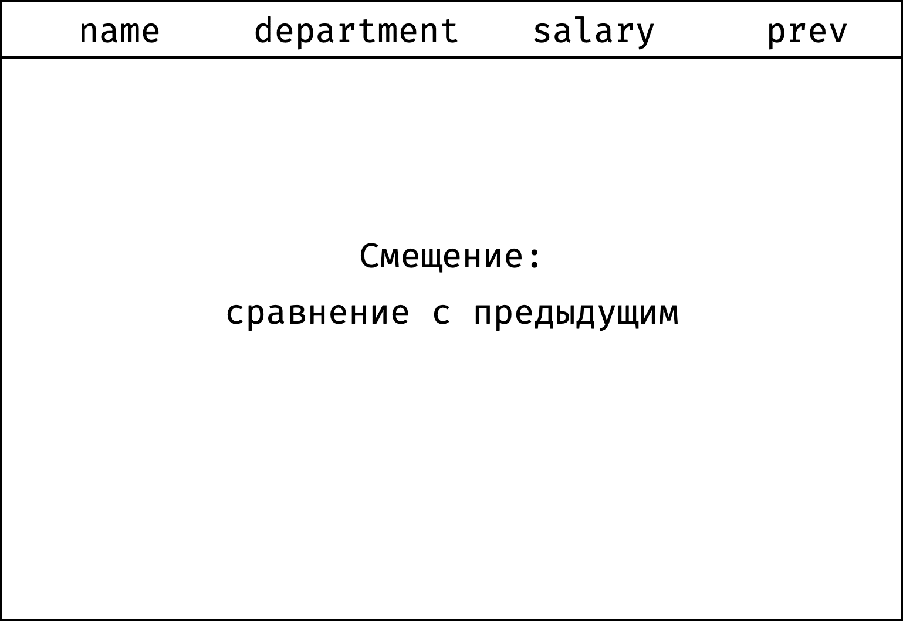
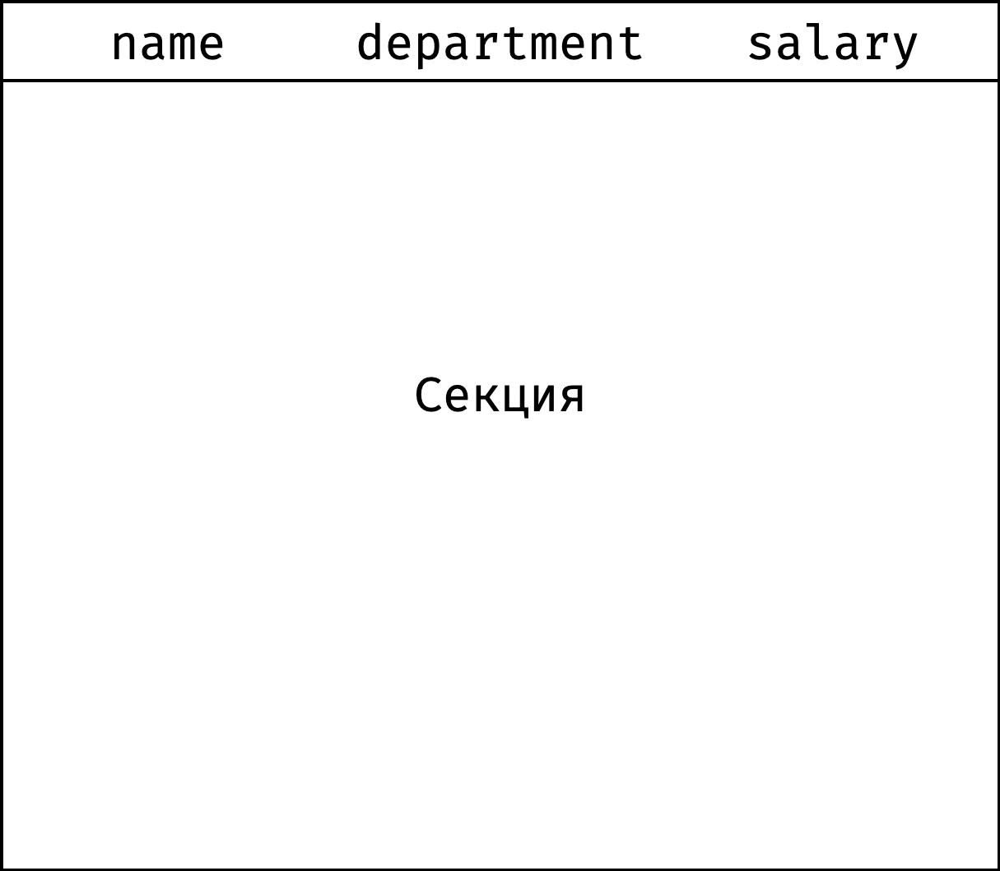
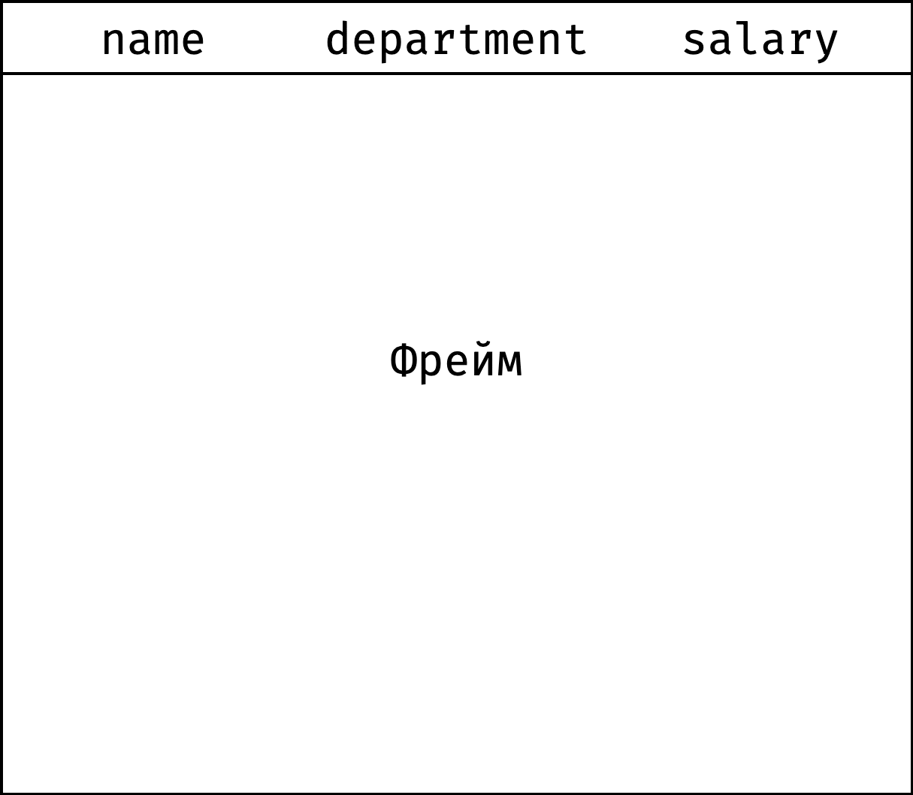
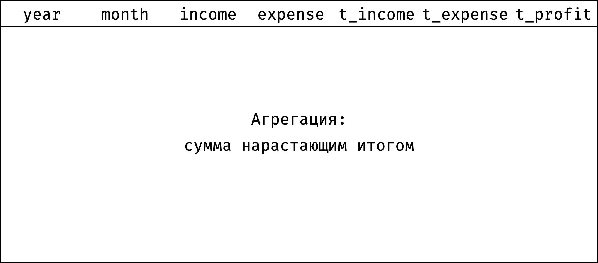
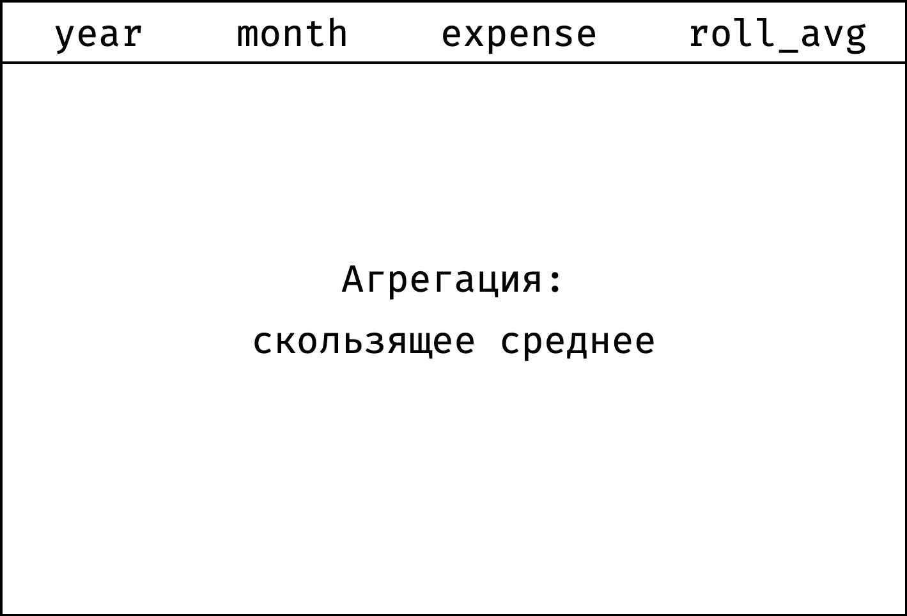
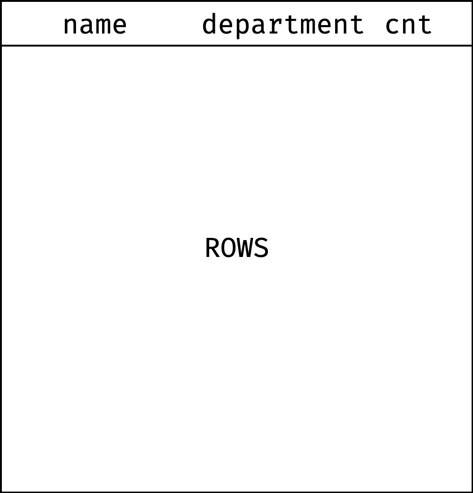
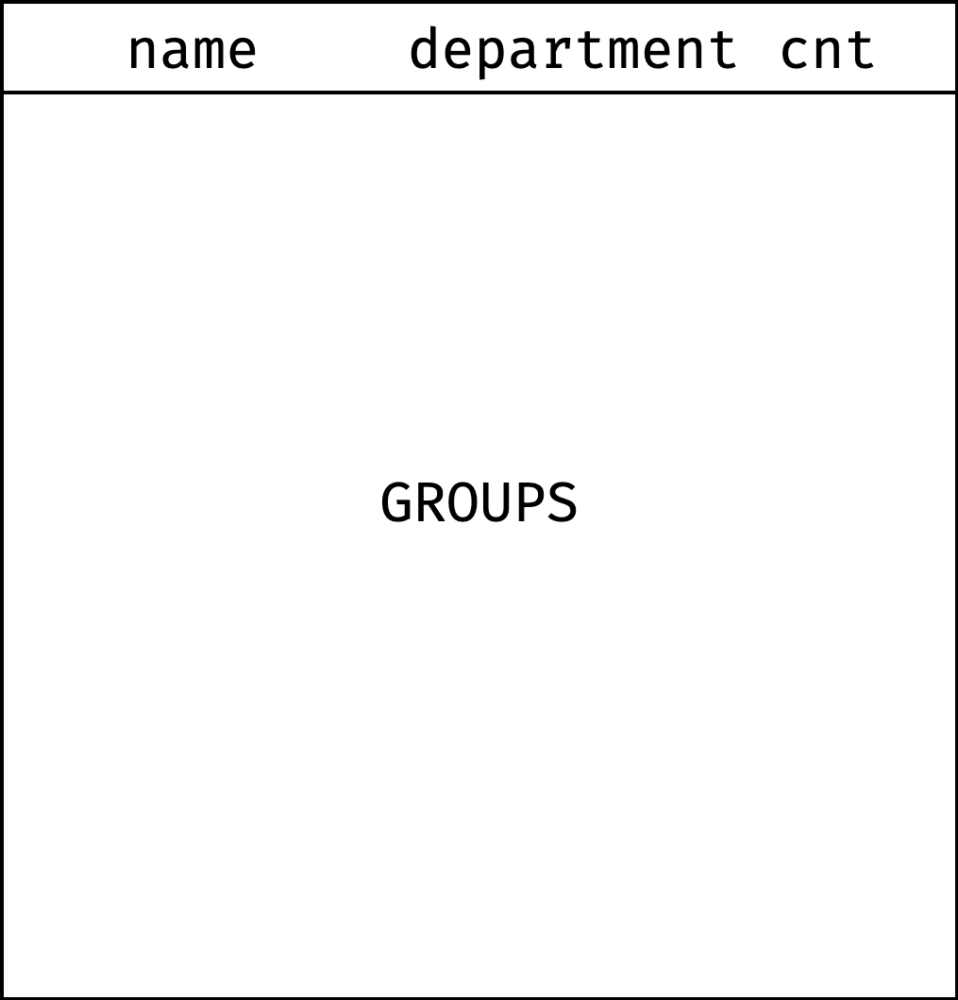

# Материалы

- [Лекция 3](???)
- [Оконные функции SQL](https://antonz.ru/window-functions/) – курс Антона Жиянова.
- [Дока по оконным функциям](https://postgrespro.ru/docs/postgresql/14/functions-window)
  - [Обработка оконных функций](https://postgrespro.ru/docs/postgresql/14/queries-table-expressions#QUERIES-WINDOW)
  - [Вызовы оконных функций](https://postgrespro.ru/docs/postgresql/14/sql-expressions#SYNTAX-WINDOW-FUNCTIONS)

# Теория

## Введение в оконные функции

### Примеры задач, решаемых через оконные функции

1. Ранжирование: составление рейтингов.
2. Сравнение со смещением: сравнение с соседним элементом или с топовым в категории.
3. Агрегация: сумма и среднее.
4. Скользящие агрегаты: сумма и среднее в динамике.

### Свойства

* Принимают в качестве аргумента столбец промежуточного результата вычисления и возвращают тоже столбец.
* Местом их использования могут быть только разделы `ORDER BY` и `SELECT`, выполняющие завершающую обработку логического промежуточного результата.
* Действуют подобно агрегатным функциям, но не уменьшают степень детализации.
* Агрегируют данные порциями, количество и размер которых регулируется специальной синтаксической конструкцией. 

### Синтаксис

``` sql
function_name(expression) OVER (
    [ <PARTITION BY clause> ]       -- окно
    [ <ORDER BY clause> ]           -- сортировка
    [ <ROWS or RANGE clause> ]      -- границы окна
) AS attr_name
```

**Основные составляющие:**
1. Функция `function_name(expression)`; виды (детальнее про которые ниже):
   1. Агрегирующая – аккумулирующая информацию по набору значений в одно.
   2. Ранжирующая – задающая порядковые номера в соответствии со значением некоторого атрибута.
   3. Смещения – обращающаяся к значению некоторого атрибута в соответствии со взаимным расположением строк таблицы.
2. Инструкция `OVER`:
   1. `PARTITION BY` – разделение общего набора строк на независимые секции;
   2. `ORDER BY` – определение сортировки внутри каждой секции (возможно всего одной);
   3. `ROWS or RANGE` – фиксирование границ окна, по которому будет производиться расчет.


### Инструкция `OVER`

*Окно* – набор строк, которые будет использовать оконная функция при расчете агрегированного значения или сортировки.

* `OVER` определяет окно для расчета и порядок строк в нём.
* Сама по себе инструкция `OVER()` не ограничена и содержит все строки из результирующего набора.
* `OVER` может многократно использоваться в одном `SELECT`-запросе, каждая со своим разделением и сортировкой.

### Порядок выполнения операций

1. Взять нужные таблицы (`from`) и соединить их при необходимости (`join`).
2. Отфильтровать строки (`where`).
3. Сгруппировать строки (`group by`).
4. Отфильтровать результат группировки (`having`).
5. Взять конкретные столбцы из результата (`select`).
6. Рассчитать значения оконных функций (`function() over window`). Пользоваться алиасами из п.5 нельзя.
7. Отсортировать то, что получилось (`order by`).

### Именование оконных функций
Когда в запросе вычисляются несколько оконных функций для одинаково определённых окон, конечно можно написать для каждой из них отдельное предложение `OVER`, но при этом оно будет дублироваться, что неизбежно будет провоцировать ошибки. Поэтому лучше определение окна выделить в предложение `WINDOW`, а затем ссылаться на него в `OVER`. Например:
``` sql
SELECT
    sum(salary) OVER w,
    avg(salary) OVER w
FROM salary
WINDOW w AS (
    PARTITION BY depname
    ORDER BY salary DESC
);
```

## Функции

### Агрегирующие

[Документация](https://www.postgresql.org/docs/current/functions-aggregate.html)

Агрегация – расчет суммарных или средних показателей. По набору значений получаем какую-то общую статистику.

| Функция               | Описание                                                                 | 
|-----------------------|--------------------------------------------------------------------------|
| `min(value)`          | Минимальное `value` среди входящих в окно строк                          |
| `max(value)`          | Максимальное `value` среди входящих в окно строк                         |
| `count(value)`        | Количество `value`, не равных `null`                                     |
| `avg(value)`          | Среднее значение по всем `value` в окне, `null` игнорируется.            |
| `sum(value)`          | Сумма значений `value` по окну                                           |
| `string_agg(value)`   | Строка, которая соединяет значения `value` через разделитель `separator` |

**Пример**

```sql
select
  name, department, salary,
  sum(salary) over w as fund,
  round(salary * 100.0 / sum(salary) over w) as perc
from employees
window w as (partition by department)
order by department, salary;
```




### Ранжирующие

Ранжирование – построение рейтинга на основе упорядочивания по значению какого-либо атрибута.

| Функция             | Описание                                                                                                                                                                                     | 
|---------------------|----------------------------------------------------------------------------------------------------------------------------------------------------------------------------------------------|
| `row_number()`      | Порядковый номер строки. Присваивает *уникальные* последовательные номера.                                                                                                                   |
| `dense_rank()`      | Ранг строки. Одинаковый для строк с равными значениями поля сортировки. У последовательных значений поля сортировки отличается на 1.                                                         |
| `rank()`            | Ранг строки с пропусками. Одинаковый для строк с равными значениями поля сортировки. У последовательных значений поля сортировки отличается на количество строк с одинаковым значением поля. |
| `ntile(n)`          | Разбивает все строки на `n` групп и возвращает номер группы, в которую попала строка.                                                                                                        |

**Пример**

```sql
SELECT
    row_number() OVER w AS rn,
    dense_rank() OVER w AS dense_rank,
    rank() OVER w AS rank,
    name,
    department,
    salary
FROM employees
WINDOW w AS (
    ORDER BY salary DESC
)
ORDER BY salary DESC;
```

| rn  | dense_rank | rank | name      | department | salary |
|-----|------------|------|-----------|------------|--------|
| 1   | 1          | 1    | Иван      | it         | 	 120  |
| 2   | _2_        | 2    | Леонид	   | it         | 	 104  |
| 3   | _2_        | 2    | Марина	   | it         | 	 104  |
| 4   | 3          | _4_  | Анна	   | sales      | 	 100  |
| 5   | _4_        | 5    | Вероника	| sales      | 	 96   |
| 6   | _4_        | 5    | Григорий	| sales      | 	 96   |
| 7   | 5          | _7_  | Ксения	   | it         | 	 90   |
| 8   | 6          | 8    | Елена     | it         | 	 84   |
| 9   | 7          | 9    | Борис     | hr         | 78     |
| 10  | 8          | 10   | Дарья     | hr         | 70     |

*Примечание:* `ntile(n)` в случае, когда количество строк в окне `k` не кратно `n`, в первые несколько (`k mod n`) групп помещает `n+1` строку, а в остальные – `n`.

Для случая с окном размером в 8 строк результат разделения будет следующий:
```
ntile(2) → 1 1 1 1 | 2 2 2 2
ntile(3) → 1 1 1 | 2 2 2 | 3 3
```

### Смещения

Сравнение со смещением – сопоставление соседних значений.

| Функция                             | Описание                                                                            | 
|-------------------------------------|-------------------------------------------------------------------------------------|
| `lag(attr, offset, default_value)`  | Предыдущее значение поля `attr` со сдвигом `offset`. При отсутствии берётся `default_value`.            |
| `lead(attr, offset, default_value)` | Следующее значение поля `attr` со сдвигом `offset`. При отсутствии берётся `default_value`. |
| `first_value(attr)`                 | Первое значение в окне с первой по текущую строку.                                  |
| `last_value(attr)`                  | Последнее значение в окне **с первой по текущую строку**.                           |

**Пример запроса**

```sql
select
  name, department, salary,
  lag(salary, 1) over w as prev
from employees
window w as (order by salary)
order by salary;

```



**Пример посложнее**

```sql
select
  name, department, salary, 
  first_value(salary) over w as low,
  last_value(salary) over w as high
from employees
window w as (
  partition by department
  order by salary
)
order by department, salary;
```

*Секция* – набор строк, определяемый `PARTITION BY`.



*Фрейм* – набор строк от начала секции, в которой он располагается, до последней записи с тем же значением поля сортировки, что и у текущей строки. Зависит от текущей записи и постоянно меняется.



**Примечание:** `first_value(attr)` и `last_value(attr)` работают именно в рамках **фрейма**, чтобы функция `last_value` выдавала значения из последней строки секции, нужно это указывать явно через следующую конструкцию:

```sql
    ROWS BETWEEN UNBOUNDED PRECEDING
    AND UNBOUNDED FOLLOWING
```

#### Работа `first_value()` и `last_value()`

1. Есть окно, которое состоит из одной или нескольких секций (`partition by department`).
2. Внутри секции записи упорядочены по конкретному столбцу (`order by salary`).
3. У каждой записи в секции свой фрейм. По умолчанию начало фрейма совпадает с началом секции, а конец для каждой записи свой.
4. Конец фрейма можно приклеить к концу секции, чтобы фрейм в точности совпадал с секцией.
5. Функция `first_value()` возвращает значение из первой строки фрейма.
6. Функция `last_value()` возвращает значение из последней строки фрейма.


## Внутренние составляющие инструкции `OVER`

### `PARTITION BY`

`PARTITION BY` указывает, из каких секций состоит окно.

* Поддерживается всеми оконными функциями, всегда необязательный раздел.
* Логически разбивает множество на группы по критериям.
* Аналитические функции применяются к группам независимо.
* Если не указать конструкцию секционирования, все множество считается одной группой.

### `ORDER BY`

`ORDER BY` отвечает за сортировку строк внутри секции.

* Поддерживается всеми оконными функциями кроме процентилей.
* Обязательно для функций ранжирования и смещения, для агрегации – нет.
* Задает критерий сортировки внутри каждой группы.
* Агрегатные функции в отсутствие конструкции `ORDER BY` вычисляются по всем строкам группы, и одно и то же значение выдается для каждой строки, т.е. функция используется как итоговая.
* Если агрегатная функция используется с конструкцией `ORDER BY`, то она вычисляется по текущей строке и всем строкам до неё, т.е. функция используется как оконная. (вычисляется нарастающий итог)

**Пример**

Поэтому посчитаем доходы и расходы по месяцам нарастающим итогом (кумулятивно).

```sql
select
  year, month, income, expense,
  sum(income) over w as t_income,
  sum(expense) over w as t_expense,
  (sum(income) over w) - (sum(expense) over w) as t_profit
from expenses
window w as (
  order by year, month
  rows between unbounded preceding and current row
)
order by year, month;

```




### `ROWS BETWEEN`

`ROWS BETWEEN` указывает, как выглядит фрейм внутри секции.

* `ROWS BETWEEN` позволяет вручную определять границы окна, для которого подсчитывается значение; умеет работать с `PRECEDING/FOLLOWING`.
* Поддерживается только функциями агрегации и `first_value()`, `last_value()`, `nth_value()`.

**Определение фрейма:**

```sql
ROWS BETWEEN frame_start AND frame_end
```

Начало фрейма (`frame_start`) может быть:

* `current row` — начиная с текущей строки;
* `N preceding` — начиная с N-й строки перед текущей;
* `N following` — начиная с N-й строки после текущей;
* `unbounded preceding` — начиная с границы секции.

Аналогично, конец фрейма (`frame_end`) может быть:

* `current row` — до текущей строки;
* `N preceding` — до N-й строки перед текущей;
* `N following` — до N-й строки после текущей;
* `unbounded following` — до границы секции.

**Пример**

Посчитаем скользящее среднее поля `expense` с усреднением по расходам за три месяца: текущий, предыдущий и следующий.

```sql
select
  year, month, expense,
  round(avg(expense) over w) as roll_avg
from expenses
window w as (
  order by year, month
  rows between 1 preceding and 1 following
)
order by year, month;
```



### `GROUPS BETWEEN`

В отличие от `ROWS BETWEEN` оперирует группами записей, у которых одинаковое значение столбца `ORDER BY`.

**Пример**

Считаем количество записей нарастающим итогом.

```sql
select
  name,
  department,
  count(*) over w as cnt
from employees
window w as (
  order by department
  rows/groups between unbounded preceding and current row
)
order by department, id;

```

Как работает для `ROWS`:



Как работает для `GROUPS`:



### `RANGE BETWEEN`

`RANGE BETWEEN` оперирует группами строк, которые попадают в обозначенный диапазон значений.

`N preceding` и `N following` означают:
* для строковых фреймов — количество записей до / после текущей;
* для групповых фреймов — количество групп до / после текущей;
* для диапазонных фреймов — диапазон значений относительно текущей записи.

## Фильтрация некоторых строк

### `EXCLUDE`

Позволяет исключить из фрейма строки.

**Виды исключений**
* `EXCLUDE NO OTHERS`. Ничего не исключать. Вариант по умолчанию: если явно не указать exclude, сработает именно он.
* `EXCLUDE CURRENT ROW`. Исключить текущую запись (как мы сделали на предыдущем шаге с сотрудником).
* `EXCLUDE GROUP`. Исключить текущую запись и все равные ей (по значению столбцов из order by).
* `EXCLUDE TIES`. Оставить текущую запись, но исключить равные ей.


**Исключение текущей строки**

```sql
window w as (
  rows between unbounded preceding and unbounded following
  exclude current row
)
```

# Практика

Работаем с датасетом employees и expenses.

Как подключаться см. в [предыдущем семинаре](https://github.com/destitutiones/hsse-db-2024/blob/main/seminars/sem02-sql-basics/sem02-sql-basics.md#%D0%BF%D1%80%D0%B0%D0%BA%D1%82%D0%B8%D0%BA%D0%B0).

## Работа на семинаре

### Таблица `employees`

1. Предположим, мы хотим ранжировать сотрудников по имени (по алфавиту от А к Я). Что должно быть вместо `<...>`?

    ```sql
    select
      dense_rank() over w as rank,
      name, department, salary
    from employees
    window w as <...>
    order by rank, id;
    ```

    <details>
      <summary>Ответ</summary>

    ```sql
    (order by name)
    ```

    </details>

2. В компании работают сотрудники из Москвы и Калуги. Предположим, мы решили ранжировать их по зарплате внутри каждого города, от меньшей зарплаты к большей. Посчитаем рейтинг. Что должно быть вместо `<...>`?

    ```sql
    select
      dense_rank() over w as rank,
      city, name, salary
    from employees
    window w as <...>
    order by city, rank, id;
    ```

    <details>
      <summary>Ответ</summary>

    ```sql
    (partition by city order by salary)
    ```

    </details>

3. В компании работают сотрудники из Москвы и Калуги. 
Мы хотим разбить их на две группы по зарплате в каждом из городов и результат отобразить в колонке `tile`,
формат результата: `(tile, name, city, salary)`, отсортирован он должен быть по полям `city, salary`. Напишите соответствующий запрос.

4. Мы хотим узнать самых высокооплачиваемых людей по каждому департаменту.
Напишите запрос, который выведет следующие поля: `(id, name, department, salary)`.

5. Мы хотим для каждого сотрудника увидеть зарплаты предыдущего и следующего коллеги.
Результат должен быть отсортирован по полям `salary` и содержать атрибуты `(name, department, prev, salary, next)`.

6. Мы хотим для каждого сотрудника увидеть, сколько процентов составляет
его зарплата от максимальной в городе. Результат должен содержать поля `(name, city, salary, percent)`, значение
в поле `percent` округлите до целого. Итоговую таблицу отсортируйте по полям `city, salary`.

7. Мы хотим для каждого сотрудника увидеть, сколько процентов составляет его зарплата от общего фонда труда по городу.
Результат должен содержать поля `(name, city, salary, fund, percent)` и быть отсортирован по полям `city, salary`.

8. Мы хотим для каждого сотрудника увидеть:
   - сколько человек трудится в его отделе (`emp_cnt`);
   - какая средняя зарплата по отделу (`sal_avg`);
   - на сколько процентов отклоняется его зарплата от средней по отделу (`diff`).
Результат должен содержать поля `(name, department, salary, emp_cnt, sal_avg, diff)` и быть отсортирован по полям
`department, salary, id`.

9. Есть следующий запрос:
    ```sql
    select
      name, department, salary,
      sum(salary) over w as fund
    from employees
    window w as (partition by department)
    order by department, salary, id;
    ```
   Как нам нужно модифицировать запрос, чтобы оставить в этом отчете только сотрудников из Калуги?

10. Есть следующий запрос:
    ```sql
    select
      city,
      department,
      sum(salary) as dep_salary,
      sum(sum(salary)) over (partition by city) as x,
      sum(sum(salary)) over () as y
    from employees
    group by city, department
    order by city, department;
    ```
    Что вернет столбец `x`?

    <details>
      <summary>Ответ</summary>
    Оконные функции выполняются уже после группировки. Поэтому можно представить, что запрос выполняется в два этапа.

    Первый:
    ```sql
    select
      city,
      department,
      sum(salary) as dep_salary
    from employees
    group by city, department;
    ```
    
    Второй:
    ```sql
    sum(dep_salary) over (partition by city) as x
    ```

    Это сумма зарплат по департаментам в пределах города — то есть суммарная зарплата по городу.
    </details>

11. Что вернет столбец `y` в том же запросе?

    <details>
      <summary>Ответ</summary>
    
    Суммарную зарплату по таблице.

    </details>

12. Вот границы фрейма для пятой записи:

    ```
    ┌──────┬───────┬────────┬─────────┐
    │ year │ month │ income │ expense │
    ├──────┼───────┼────────┼─────────┤
    │ 2020 │ 1     │ 94     │ 82      │
    │ 2020 │ 2     │ 94     │ 75      │ <- начало фрейма
    │ 2020 │ 3     │ 94     │ 104     │
    │ 2020 │ 4     │ 100    │ 94      │
    │ 2020 │ 5     │ 100    │ 99      │ <- текущая
    │ 2020 │ 6     │ 100    │ 105     │
    │ 2020 │ 7     │ 100    │ 95      │ <- конец фрейма
    │ 2020 │ 8     │ 100    │ 110     │
    │ 2020 │ 9     │ 104    │ 104     │
    └──────┴───────┴────────┴─────────┘
    ```

    Как выглядит определение фрейма?

    <details>
      <summary>Ответ</summary>
    
    ```
    rows between 3 preceding and 2 following
    ```

    </details>

13. Хотим посчитать фонд оплаты труда нарастающим итогом независимо для каждого департамента. Сортировка результата: `department, salary`, атрибуты в результате: `(id, name, department, salary, total)`.

14. Напишите запрос, который для каждого сотрудника `(id, name, department, salary)` выведет:

    - `prev_salary`: размер з/п предыдущего по зарплате сотрудника (среди коллег по департаменту);
    - `max_salary`: максимальную з/п по департаменту.

    Если нет "предыдущего коллеги", то запрос должен возвращать з/п самого сотрудника. `lag()` и `lead()` использовать нельзя.

15. Предположим, для каждого человека мы хотим посчитать количество сотрудников, которые получают такую же или большую зарплату, но не более чем +10 тыс. рублей (`p10_cnt`). Атрибуты в результате: `(id, name, salary, p10_cnt)`, порядок сортировки: `salary, id`.

16. Для каждого человека мы хотим определить максимальную зарплату среди тех, у кого зарплата на 10–30 тыс. рублей меньше чем у него. Атрибуты в результате: `(id, name, salary, lower_sal)`, порядок сортировки: `salary, id`.


### Таблица `expenses`

1. Мы хотим рассчитать скользящее среднее по доходам за предыдущий и текущий месяц. Сортировка результата: `year, month`, атрибуты в результате: `(year, month, income, roll_avg)`.

<details>
  <summary>Всё</summary>
    


</details>
