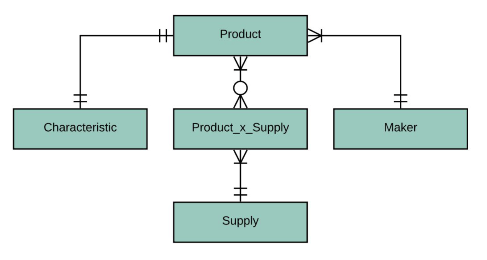
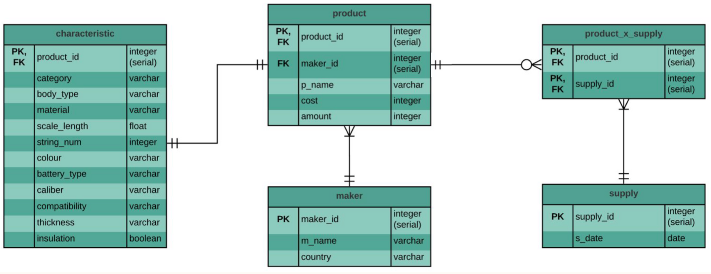
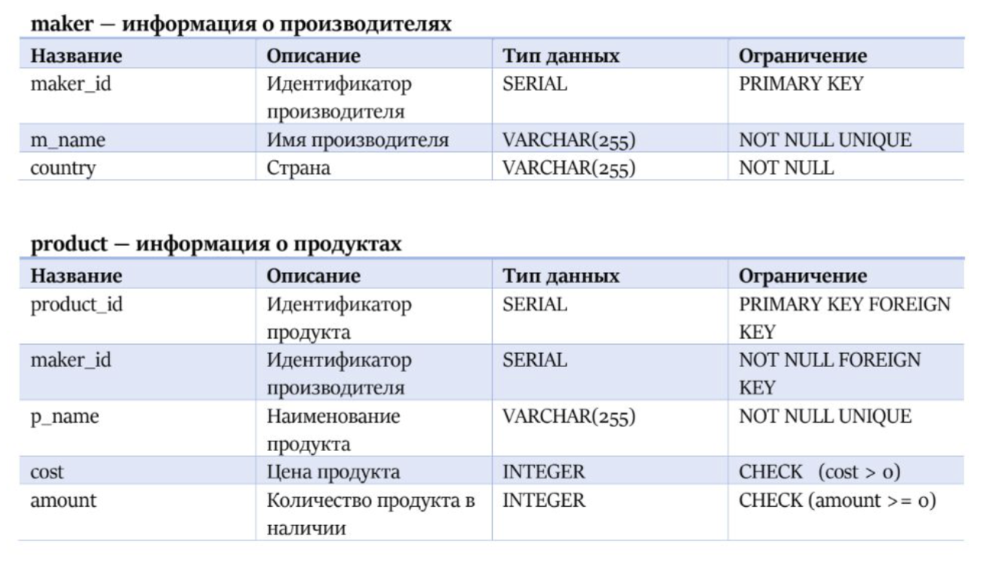
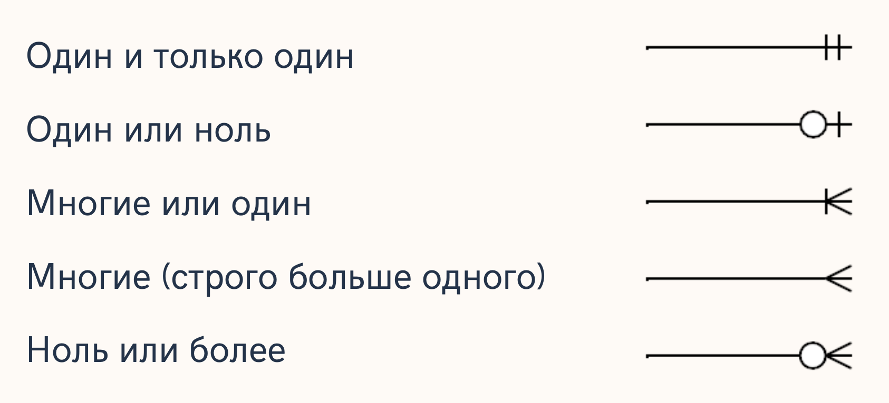
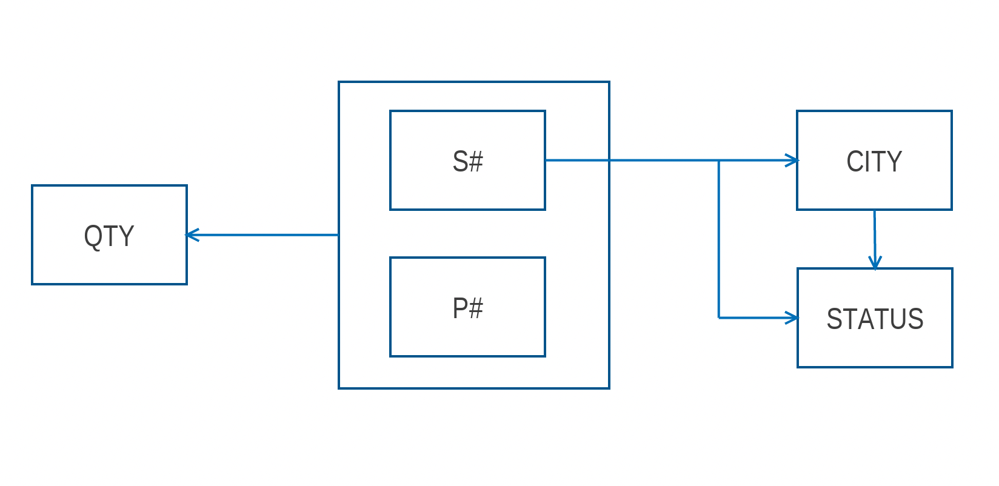
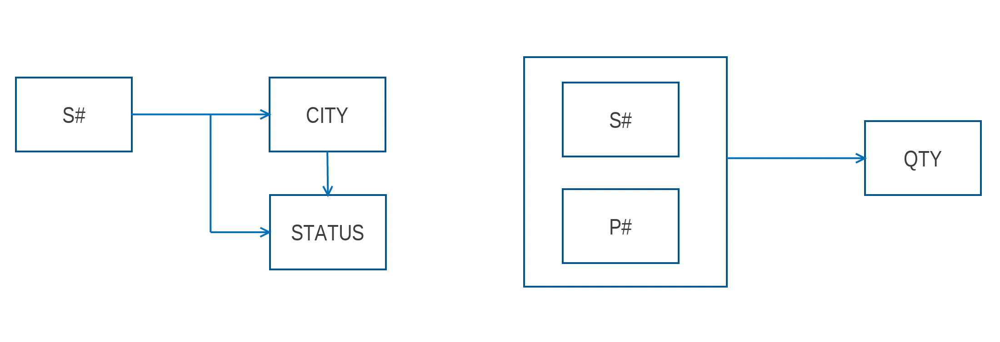
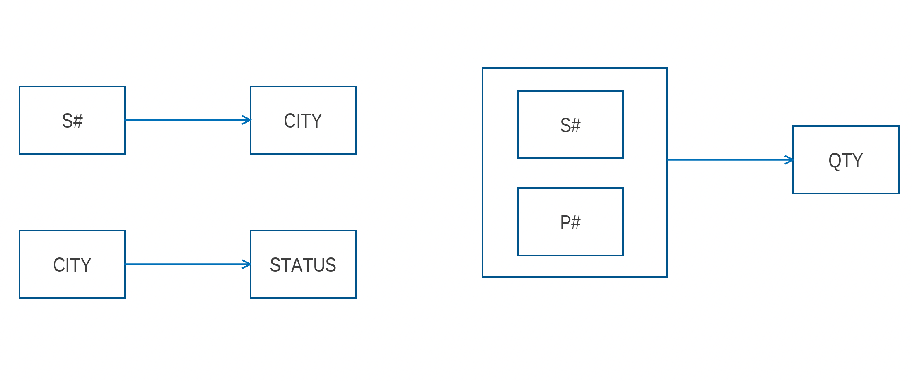

# Материалы

- [Лекция 4](https://drive.google.com/file/d/1fDmQ2LPY21pUXBQDRxYpmCh-ATXeu7sV/view?usp=sharing)
- [Туториал](https://www.tutorialsteacher.com/postgresql/identity-column) по identity-column.

# Теория

## Проектирование

### Основные этапы проектирования

Рассматриваем на примере проектирования БД гитарного магазина.

#### Концептуальное проектирование

1. Определяем предметную область, с которой будем работать. Например, предметная область ритейла.
2. Разбиваем на не детализированные сущности. Например, чек покупки, продукт, магазин, ассортиментная матрица и т.д.
3. Определяем, как сущности будут друг с другом связаны: один к одному, один ко многим и т.д.
4. Строим визуальную картину в ER-нотации "Воронья лапка" (Crow's Foot) _без явных атрибутов_.

**Пример результата:**



#### Логическое проектирование

1. Разбиваем сущности из этапа концептуального проектирования на детализированные согласно выбранной модели данных и нормализации.
2. Определяем атрибуты, связи между сущностями по атрибутам.
3. Строим визуальную картину в ER-нотации "Воронья лапка" (Crow's Foot) _с явными атрибутами_.

**Пример результата:**



#### Физическое проектирование

1. Создаем логическую схему базы данных для конкретной СУБД.
2. Учитываем возможные ограничения на именование объектов базы данных, поддерживаемые типы данных и т.п.
3. Пишем SQL-скрипт с созданием таблиц с учётом всех заявленных ограничений или детальную таблицу-образец для дальнейшего написания скриптов.

**Пример результата в виде таблицы:**

*Note.* Вместо `VARCHAR(255)` предпочтительнее использовать `TEXT`, а вместо `SERIAL` – `identity-column` (см. материалы в самом начале).



### Нотация "Воронья лапка"

* Сущность изображается в виде прямоугольника, содержащего ее имя.
* Атрибуты сущности (для логической модели) записываются внутри прямоугольника, изображающего сущность.
* Связь изображается линией, которая соединяет две сущности, участвующие в отношении.
* Описания связей выглядят следующим образом:



### Нормализация

**Нормализацией БД** называют приведение БД к нормальной форме.

**Нормальная форма**:
- совокупность требований, которым должно удовлетворять отношение для уменьшения вероятности возникновения аномалий;
- свойство отношения в реляционной модели данных, характеризующее его с точки зрения избыточности, потенциально приводящей к логически ошибочным результатам выборки или изменениям данных.

**Для чего нормализация предназначена:**

- Минимизация логической избыточности.
- Уменьшение потенциальной противоречивости.
- Исключение некоторых типов избыточности.
- Устранение некоторых аномалий обновления.

**Для чего нормализация не предназначена:**
- Уменьшение/увеличение производительности или физического объема БД.

#### Определения

- *Декомпозиция* – разложение исходной переменной отношения на несколько эквивалентных. Обратимая декомпозиция называется *декомпозицией без потерь* или *правильной*. 
- *Аномалия* – ситуация в таблице БД, которая приводит к противоречию в БД либо существенно усложняет обработку БД. Причиной является излишнее дублирование данных в таблице, которое вызывается наличием функциональных зависимостей от не ключевых атрибутов. 
- *Функциональная зависимость* между множествами атрибутов **A** и **B** означает, что для любого допустимого набора кортежей в данном отношении верно следующее: если два кортежа совпадают по значению **A**, то они совпадают по значению **B**.
- *Минимальная функциональная зависимость* означает, что в составе первичного ключа отсутствует меньшее подмножество атрибутов, от которого можно также вывести данную функциональную зависимость.

#### Нормальная форма 1 (1НФ)

Переменная отношения находится в **первой нормальной форме** тогда и только тогда, когда в любом допустимом значении этой переменной отношения каждый её кортеж содержит только одно значение для каждого из атрибутов. **tl;dr** все атрибуты скалярные.

**Пример отношения:**

| S#  | SNAME  | CITY   | 	P#                       | QTY                            |
|-----|--------|--------|---------------------------|--------------------------------|
| S1  | Smith  | London | 	[P1, P2, P3, P4, P5, P6] | [300, 200, 400, 200, 100, 100] |
| S2  | Jones  | Paris  | 	[P1, P2, P3]             | [300, 400, 200]                |
| S4  | Clark  | London | 	[P2, P4, P5]             | [200, 300, 400]                |

**Отношение в 1НФ:**

| S#  | 	SNAME	 | CITY    | 	P#  | 	QTY |
|-----|---------|---------|------|------|
| S1  | 	Smith  | 	London | 	P1  | 	300 |
| S1  | 	Smith  | 	London | 	P2  | 	200 |
| S1  | 	Smith  | 	London | 	P3  | 	400 |
| S1  | 	Smith  | 	London | 	P4  | 	200 |
| S1  | 	Smith  | 	London | 	P5  | 	100 |
| S1  | 	Smith  | 	London | 	P6  | 	100 |
| S2	 | Jones	  | Paris   | 	P1  | 	300 |
| S2	 | Jones	  | Paris   | 	P2  | 	400 |
| S2	 | Jones	  | Paris   | 	P2	 | 200  |
| S4	 | Clark	  | London  | 	P3	 | 200  |
| S4	 | Clark	  | London  | 	P4	 | 300  |
| S4	 | Clark	  | London  | 	P5	 | 400  |

**Определения:**
* Пусть X и Y – произвольные подмножества множества атрибутов отношения R. Тогда **Y функционально зависимо от X** (X $\rightarrow$ Y) тогда и только тогда, когда каждое значение множества X отношения R связано точно с одним значением множества Y отношения R.
В этом случае X называют детерминантом, а Y – зависимой частью.
* Функциональная зависимость называется **тривиальной**, если зависимая часть является подмножеством детерминанта.
* **Неприводимость** означает, что в составе потенциального ключа отсутствует меньшее подмножество атрибутов, от которого можно также вывести данную функциональную зависимость.

**Какие функциональные зависимости наблюдаем в отношении выше?**


<details>
  <summary>Примеры функциональных зависимостей</summary>

* {S#} $\rightarrow$ {SNAME} – неприводимая зависимость.
* {S#} $\rightarrow$ {CITY} – неприводимая зависимость.
* {S#, P#} $\rightarrow$ {QTY} – неприводимая зависимость.
* {S#, P#} $\rightarrow$ {#S} – тривиальная зависимость.
* {S#, SNAME, P#} $\rightarrow$ {CITY}

</details>

#### Нормальная форма 2 (2НФ)

Переменная отношения находится во **второй нормальной форме** тогда и только тогда, когда она находится в первой нормальной форме и каждый неключевой атрибут _неприводимо_ зависит от его первичного ключа.

**Пример отношения:**

| S#  | 	STATUS	 | CITY    | 	P#  | 	QTY |
|-----|----------|---------|------|------|
| S1  | 	20      | 	London | 	P1  | 	300 |
| S1  | 	20      | 	London | 	P2  | 	200 |
| S1  | 	20      | 	London | 	P3  | 	400 |
| S1  | 	20      | 	London | 	P4  | 	200 |
| S1  | 	20      | 	London | 	P5  | 	100 |
| S1  | 	20      | 	London | 	P6  | 	100 |
| S2	 | 10	      | Paris   | 	P1  | 	300 |
| S2	 | 10	      | Paris   | 	P2  | 	400 |
| S2	 | 10	      | Paris   | 	P2	 | 200  |
| S4	 | 20	      | London  | 	P3	 | 200  |
| S4	 | 20	      | London  | 	P4	 | 300  |
| S4	 | 20	      | London  | 	P5	 | 400  |


**Диаграмма зависимостей**



**Отношение во 2НФ**

Производим декомпозицию.

_Suppliers_

| S#  | 	STATUS	 | CITY    |
|-----|----------|---------|
| S1  | 	20      | 	London |
| S2	 | 10	      | Paris   |
| S3	 | 10	      | Paris   |
| S4	 | 20	      | London  |
| S5	 | 30	      | Athens  |

_SP_

| S#   | 	P#  | 	QTY |
|------|------|------|
| S1   | 	P1  | 	300 |
| S1   | 	P2  | 	200 |
| S1   | 	P3  | 	400 |
| S1   | 	P4  | 	200 |
| S1   | 	P5  | 	100 |
| S1   | 	P6  | 	100 |
| S2	| 	P1  | 	300 |
| S2	| 	P2  | 	400 |
| S2	| 	P2	 | 200  |
| S4	| 	P3	 | 200  |
| S4	| 	P4	 | 300  |
| S4	| 	P5	 | 400  |

**Обновленная диаграмма зависимостей**



**Все ли аномалии обновления мы решили?**

<details>
  <summary>Ответ</summary>

Нет.

* `INSERT`: Нельзя вставить информацию о том, что определенный город характеризуется некоторым статусом.
* `DELETE`: Если из отношения `Suppliers` удалить кортеж, который является единственным для города, то будет удалена не только информация о поставщике из данного города, но и статус, который соответствует городу.
* `UPDATE`:
  * В переменной отношения `Suppliers` информация о статусе для города повторяется несколько раз. При смене статуса в городе эту информацию нужно менять в нескольких местах.
  * Если статус будет изменен не везде, то база данных будет в несогласованном состоянии.

</details>

**В чем причина?**

<details>
  <summary>Ответ</summary>

Переменная отношения `Suppliers` содержит информацию и о поставщиках, и о городах – произошло смешивание информации.

</details>

#### Нормальная форма 3 (3НФ)

Переменная отношения находится в **третьей нормальной форме** тогда и только тогда, когда она находится во второй нормальной форме и ни один неключевой атрибут не является транзитивно зависимым от ее первичного ключа.

**Текущее состояние схемы. Транзитивная зависимость**


**Отношение в 3НФ:**

_Suppliers_

| S#  	 | CITY    |
|-------|---------|
| S1    | 	London |
| S2    | Paris   |
| S3    | Paris   |
| S4    | London  |
| S5    | Athens  |

_Status_

| CITY   | STATUS  |
|--------|---------|
| London | 20      |
| Paris  | 10      |
| Athens | 30      |
| Rome   | 50      |


_SP_

| S#   | 	P#  | 	QTY |
|------|------|------|
| S1   | 	P1  | 	300 |
| S1   | 	P2  | 	200 |
| S1   | 	P3  | 	400 |
| S1   | 	P4  | 	200 |
| S1   | 	P5  | 	100 |
| S1   | 	P6  | 	100 |
| S2	| 	P1  | 	300 |
| S2	| 	P2  | 	400 |
| S2	| 	P2	 | 200  |
| S4	| 	P3	 | 200  |
| S4	| 	P4	 | 300  |
| S4	| 	P5	 | 400  |




**Свойства 3НФ:**
* (+) Позволяет решить проблемы обновлений в большинстве случаев, которые части случаются на практике
* (-) Основывается на допущении, что в каждой переменной отношения только один потенциальный ключ

## Ограничения

### Ключи

**Потенциальный ключ** (Candidate key, CK) – подмножество атрибутов отношения, удовлетворяющее требованиям уникальности и минимальности:
* *Уникальность*: нет и <ins>не может быть</ins> двух кортежей данного отношения, в которых значения этого подмножества атрибутов совпадают;
* *Минимальность*: в составе потенциального ключа отсутствует меньшее подмножество атрибутов, удовлетворяющее условию уникальности;
* Типы:
    * *простой* (состоит ровно из одного атрибута)
    * *составной* (состоит из двух и более атрибутов)

**Первичный ключ** *(Primary key, PK)* — любой из потенциальных ключей, выбранный в качестве основного; выбирают в качестве первичного такой ключ, который занимает меньше места при хранении и который не утратит свою уникальность со временем. (потенциальный ключ существует всегда, даже если включает в себя все атрибуты отношения) **Альтернативными ключами** называются потенциальные ключи, не выбранные в качестве первичного.

Типы:
* *естественный* – основанный на уже существующем поле
* *интеллектуальный* – основанный на естественном ключе путем добавления дополнительного поля

**Суррогатный ключ** — это дополнительное служебное поле, которое добавляется к уже имеющимся информационным полям таблицы, единственное предназначение которого – служить первичным ключом. (значение генерируется искусственно).
* *Достоинства:*
    * *Гарантированная уникальность:* т.к. значение генерируется автоинкрементом, повторение значений исключено.
    * *Память:* может быть меньше, чем первичный ключ из отношения.
    * *Неизменность:* заполнили одним значением раз и навсегда (кроме экстраординарных ситуаций)
    * *Гибкость:* т.к. такой ключ не несет никакой информативной нагрузки, его можно свободно заменить.
    * *Проще программировать:* позволяет не завязывать на структуре конкретной БД. Особенно удобно для языков со статической типизацией.
    * *Эффективность:* удобнее при создании ссылок на другие таблицы.
* *Недостатки:*
    * *Уязвимость генераторов:* по номерам ключей возможно узнать число новых записей за определенный период времени.
    * *Неинформативность:* усложняется ручная проверка БД
    * *Склоняет администратора пропустить нормализацию:* вместо того, чтобы разбить отношение на несколько отношений и аккуратно учесть все связи, велик соблазн просто создать суррогатный ключ. (Примечание: о нормализации подробнее узнаем в следующей серии)
    * *Вопросы оптимизации:* необходимость поддержания и суррогатного, и естественного ключей.
    * Невольная привязка разработчика к поведению генератора ключей в конкретной СУБД
    * Сами выбираем алгоритм генерации → можно узнать свойства нашей модели данных по ключам, также можно ошибиться, придумывая алгоритм генерации.


Пусть R<sub>1</sub> и R<sub>2</sub> – две переменные отношения, не обязательно различные. **Внешним ключом FK (Foreign key)** в R<sub>2</sub> является подмножество атрибутов переменной R<sub>2</sub> такое, что выполняются следующие требования:
* В переменной отношения R<sub>1</sub> имеется потенциальный ключ PK такой, что PK и FK совпадают с точностью до переименования атрибутов (FK из R<sub>2</sub> является PK из R<sub>1</sub>)
* В любой момент времени каждое значение FK в текущем значении R<sub>2</sub> идентично значению PK в некотором кортеже в текущем значении R<sub>1</sub>. Иными словами, в любой момент времени множество всех значений FK в R<sub>2</sub> является подмножеством значений PK в R<sub>1</sub>.

* *Родительское (главное/целевое) отношение* — отношение R<sub>1</sub>, содержащее потенциальный ключ.
* *Дочернее (подчиненное) отношение* — отношение R<sub>2</sub>, содержащее в себе ссылку на сущность, в которой находятся нужные нам атрибуты. (содержащее в себе внешний ключ)

### Ссылочная целостность и немного лирики

**Ссылочная целостность** – это необходимое качество реляционной базы данных, заключающееся в отсутствии в любом её отношении внешних ключей, ссылающихся на несуществующие кортежи.

База данных обладает свойством ссылочной целостности, когда для любой пары связанных внешним ключом отношений в ней условие ссылочной целостности выполняется.

**В реальных бд ссылочная целостность не всегда поддерживается.**

Нарушения ссылочной целостности могут появиться в ходе эксплуатации по ряду причин:
* Иногда разработчики просто пропускают шаг создания ссылок
* Некорректная работа прикладного программного обеспечения:
    * Неполная запись объектов (данные объекта размещаются в записях нескольких таблиц, а программа не записывает какую-то из них).
    * Некорректная правка ссылки (значение внешнего ключа изменяется на такое, которому не соответствует ни одна запись в связанной таблице)
    * Правка первичного ключа без каскадного обновления (в таблице, на которую есть ссылки, правится первичный ключ, но при этом внешние ключи в связанных с ней таблицах остаются без изменения)
    * Удаление записи без каскадного обновления (Из таблицы удаляется запись, на которую имеются ссылки по внешним ключам других таблиц, при этом в связанных записях внешние ключи не меняются. В результате все ссылающиеся на нее записи других таблиц становятся некорректными)
* Сбои в работе системного программного обеспечения и оборудования:
    * Если необходимо внести данные об объекте в несколько страниц, то в ходе транзакции ссылочная целостность будет нарушена — в часть таблиц информация уже внесена, а в часть — еще нет. Так, если операция будет прервана до завершения по каким-то техническим причинам, то часть добавленных записей останется с некорректными ссылками.
* Иногда же на практике при отсутствии какой-то информации об объекте ключ остается пустым (имеет значение NULL). И хотя с точки зрения теории это недопустимо, легенда гласит, что на практике это иногда удобно в применении.

### Виды ограничений

1. `NOT NULL` – значение всегда известно, недопустимо значение `NULL`.
2. `UNIQUE` – значения в столбце должны быть уникальны.
3. `PRIMARY KEY` – первичный ключ таблицы. В некоторых СУБД требуется дополнительно ограничивать `NOT NULL` (чаще выставлено по дефолту; также заведомо является `UNIQUE`)
4. `FOREIGN KEY` – внешний ключ, необходима ссылка на другую таблицу.
5. `CHECK` – проверка на соответствие определенному критерию.
6. `DEFAULT` – значение по умолчанию; используется, если пользователь не задал значения.

### Синтаксис добавления ограничений

1. `NOT NULL`
```sql
CREATE TABLE PERSON (
    ID         INTEGER      NOT NULL,
    LAST_NAME  VARCHAR(255) NOT NULL,
    FIRST_NAME VARCHAR(255) NOT NULL,
    AGE        INTEGER
);
```

2. `UNIQUE`
```sql
CREATE TABLE PERSON (
    ID         INTEGER      NOT NULL UNIQUE,
    LAST_NAME  VARCHAR(255) NOT NULL,
    FIRST_NAME VARCHAR(255) NOT NULL,
    AGE        INTEGER
);

ALTER TABLE PERSON ADD UNIQUE (ID);

ALTER TABLE PERSON
ADD CONSTRAINT UC_Person UNIQUE (ID, LAST_NAME);

ALTER TABLE PERSON
DROP CONSTRAINT UC_Person;
```

3. `PRIMARY KEY`
```sql
CREATE TABLE PERSON (
    ID         INTEGER      PRIMARY KEY,
    LAST_NAME  VARCHAR(255) NOT NULL,
    FIRST_NAME VARCHAR(255) NOT NULL,
    AGE        INTEGER
);

ALTER TABLE PERSON ADD PRIMARY KEY (ID);

------------------------------------------

CREATE TABLE PERSON (
    ID         INTEGER,
    LAST_NAME  VARCHAR(255),
    FIRST_NAME VARCHAR(255) NOT NULL,
    AGE        INTEGER,
    CONSTRAINT PK_Person PRIMARY KEY (ID, LAST_NAME)
);

ALTER TABLE PERSON
ADD CONSTRAINT PK_Person PRIMARY KEY (ID, LAST_NAME);

ALTER TABLE PERSON
DROP CONSTRAINT PK_Person;
```

4. `FOREIGN KEY`
```sql
CREATE TABLE ORDER (
    ORDER_ID     INTEGER,
    ORDER_NUMBER INTEGER NOT NULL,
    PERSON_ID    INTEGER,
    
    PRIMARY KEY (ORDER_ID),
    CONSTRAINT FK_PersonOrder FOREIGN KEY (PERSON_ID) REFERENCES PERSON(PERSON_ID)
);

ALTER TABLE ORDER ADD CONSTRAINT FK_PersonOrder
FOREIGN KEY (PERSON_ID) REFERENCES PERSON(PERSON_ID);

ALTER TABLE ORDER DROP CONSTRAINT FK_PersonOrder;

------------------------------------------

CREATE TABLE ORDER (
    ORDER_ID     INTEGER PRIMARY KEY,
    ORDER_NUMBER INTEGER NOT NULL,
    PERSON_ID    INTEGER REFERENCES PERSON(PERSON_ID)
);

ALTER TABLE ORDER
ADD FOREIGN KEY (PERSON_ID) REFERENCES PERSON(PERSON_ID);
```

При определении FK у нас должно совпадать количество атрибутов в обеих таблицах, которые мы "мэтчим". Также в таблице, для которой атрибуты являются PK, должны быть заданы соответствующие ограничения – иначе будет ошибка `there is no unique constraint matching given keys for referenced table`.

<span>&ensp;&nbsp;</span>4<span>&frac34;</span>. Поддержание ссылочной целостности

* `CASCADE` – при удалении / изменении строки главной таблицы соответствующая запись дочерней таблицы также будет удалена / изменена.

* `RESTRICT` – cтрока не может быть удалена / изменена, если на нее имеется ссылка;  Значение не может быть удалено / изменено, если на него есть ссылка.

* `NO ACTION`

    * По дефолту ведет себя аналогично `RESTRICT`, но есть возможность настроить проверку в конце транзакции (параметр `DEFERRED` – отложенный);
    * Для разницы с `RESTRICT` нужно явно прописывать в транзакции выражение ([`SET CONSTRAINTS`](https://www.postgresql.org/docs/current/sql-set-constraints.html))

    ```sql
    SET CONSTRAINTS { ALL | name [, ...] } { DEFERRED | IMMEDIATE }
    ```

* `SET NULL` – при удалении записи главной таблицы, соответствующее значение дочерней таблицы становится `NULL`.

* `SET DEFAULT` – аналогично `SET NULL`, но вместо значения `NULL` устанавливается некоторое значение по умолчанию.

```sql
CREATE TABLE ORDER (
    ORDER_ID     INTEGER,
    ORDER_NUMBER INTEGER NOT NULL,
    PERSON_ID    INTEGER,
    
    PRIMARY KEY (ORDER_ID),
    CONSTRAINT FK_PersonOrder FOREIGN KEY (PERSON_ID)
        REFERENCES PERSON(PERSON_ID)
            ON DELETE RESTRICT
            ON UPDATE RESTRICT
);
```

5. `CHECK`
```sql
CREATE TABLE PERSON (
    ID         INTEGER      NOT NULL,
    LAST_NAME  VARCHAR(255) NOT NULL,
    FIRST_NAME VARCHAR(255) NOT NULL,
    AGE        INTEGER      CHECK (AGE >= 18)
);

ALTER TABLE PERSON ADD CHECK (AGE >= 18);

------------------------------------------

CREATE TABLE PERSON (
    ID          INTEGER      NOT NULL,
    LAST_NAME   VARCHAR(255) NOT NULL,
    FIRST_NAME  VARCHAR(255) NOT NULL,
    AGE         INTEGER,
    CITY        VARCHAR(255),
    CONSTRAINT CHK_Person CHECK (AGE >= 18 AND CITY = 'Moscow')
);

ALTER TABLE PERSON ADD CONSTRAINT CHK_Person
CHECK (AGE >= 18 AND CITY = 'Moscow');

ALTER TABLE PERSON DROP CONSTRAINT CHK_Person;
```

6. `DEFAULT`
```sql
CREATE TABLE ORDER (
    ORDER_ID     INTEGER PRIMARY KEY,
    ORDER_NUMBER INTEGER NOT NULL,
    ORDER_DATE   DATE    DEFAULT now()::date
);

ALTER TABLE ORDER;
ALTER COLUMN ORDER_DATE DROP DEFAULT;
```

Есть возможность посмотреть все **имеющиеся в базе ограничения**:

```sql
-- Список колонок, попадающих под ограничение:
SELECT * FROM information_schema.constraint_column_usage;

-- Все имеющиеся в базе ограничения:
SELECT * FROM information_schema.table_constraints;

-- Уникальные и ключевые (PK, FK) поля таблиц
SELECT * FROM information_schema.key_column_usage;

-- Информация по ограничениям с типом `CHECK`
SELECT * FROM information_schema.check_constraints;

-- Информация по ограничениям с типом `DEFAULT` и `NOT NULL`
SELECT * FROM information_schema.columns;
```