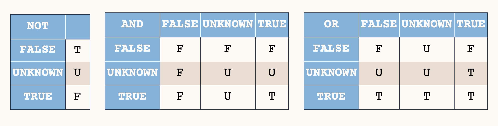

# Материалы

- [Лекция 5](https://drive.google.com/file/d/1_-xrkh1Kex8YnfENbpxTmBvG46Iul93I/view?usp=sharing)
- Статья
  [Recursive SQL Expression Visually Explained](https://builtin.com/data-science/recursive-sql)

# Теория

## Подзапросы

**Подзапрос** — запрос, содержащийся в другом SQL-запросе. Запрос, содержащий
другой подзапрос, называется _содержащим выражением_.

- Подзапрос всегда заключен в круглые скобки и обычно выполняется до содержащего
  выражения.
- Подзапросы могут вкладываться друг в друга.
- В `SELECT`'e подзапросы можно использовать во всех разделах, кроме `GROUP BY`.

**Классификация подзапросов:**

1. По взаимодействию с содержащим выражением:
   - Связанные (т.е. ссылающиеся на столбцы основного запроса):
     - Для написания таких запросов полезно использование алиасов.
       (`SELECT … AS T`)
     - Для случаев, когда в основном запросе и в подзапросе используется одна и
       та же таблица, использование алиасов обязательно!
     - Выполняются для каждой строки содержащего выражения.
   - Несвязанные (т.е. полностью самодостаточные и не зависящие от основного
     запроса) — выполняются перед выполнением содержащего выражения.
2. По результату выполнения:
   - Скалярные (1 столбец и 1 строка)
   - Нескалярные

**Использование подзапросов:**

| Раздел     | Связанные | Несвязанные | Нескалярные |
| ---------- | --------- | ----------- | ----------- |
| `SELECT`   | +         | +           | –           |
| `FROM`     | –         | +           | +           |
| `WHERE`    | +         | +           | +           |
| `HAVING`   | +         | +           | +           |
| `ORDER BY` | +         | +           | –           |

### Предикаты

Применяются в основном с подзапросами вида 1 столбец и несколько строк.

- `EXISTS` — Значением условия `EXISTS` является `TRUE` в том и только в том
  случае, когда мощность таблицы-результата подзапроса больше нуля, иначе
  значением условия является `FALSE`:

```sql
SELECT
    SupplierName
FROM
    Suppliers
WHERE
    EXISTS(
        SELECT
            ProductName
        FROM
            Products
        WHERE
            SupplierId = Suppliers.supplierId
            AND Price < 20
    );
```

- `IN` — Предикат `IN` для подзапросов работает так же, как и для обычных
  запросов (проверка наличия значения в списке):

```sql
SELECT
    emp_id,
    fname,
    lname,
    title
FROM
    employee
WHERE
    emp_id IN(
        SELECT
            superior_emp_id
        FROM
            employee
    );
```

- `ALL` — `TRUE`, если результат подзапроса пуст или значение предиката равно
  TRUE для каждой строки подзапроса; если хотя бы что-то `FALSE`, то вернет
  `FALSE`, во всех остальных случаях вернет `UNKNOWN`:

```sql
SELECT
    EMP_NO
FROM
    EMP
WHERE
    DEPT_NO = 65
    AND EMP_SAL >= ALL(
        SELECT
            EMP1.EMP_SAL
        FROM
            EMP AS EMP1
        WHERE
            EMP.DEPT_NO = EMP1.DEPT_NO
    );
```

- `ANY` — `FALSE`, если результат подзапроса пуст или значение условия равно
  `FALSE` для каждой строки подзапроса; если хотя бы что-то `TRUE`, то вернет
  `TRUE`, в остальных случаях вернет `UNKNOWN`:

```sql
SELECT
    EMP_NO
FROM
    EMP
WHERE
    DEPT_NO = 65
    AND EMP_SAL > ANY(
        SELECT
            EMP1.EMP_SAL
        FROM
            EMP AS EMP1
        WHERE
            EMP.DEPT_NO = EMP1.DEPT_NO
    );
```

`CREATE TABLE AS` — создаёт таблицу и наполняет её данными, полученными в
результате выполнения `SELECT`. Столбцы этой таблицы получают имена и типы
данных в соответствии со столбцами результата `SELECT` (хотя имена столбцов
можно переопределить, добавив явно список новых имен столбцов).

```sql
CREATE TABLE NEW_TABLE AS
    SELECT
        *
    FROM
        OLD_TABLE;
```

`CREATE TABLE AS` напоминает создание представления, но на самом деле есть
значительная разница: эта команда создает новую таблицу и выполняет запрос
только раз, чтобы наполнить таблицу начальными данными. Последующие изменения в
исходных таблицах запроса в новой таблице отражаться не будут. С представлением,
напротив, определяющая его команда `SELECT` выполняется при каждой выборке из
него.

## Троичная логика

Если `NULL` как-то влияет на результат логического выражения, то результат не
определен:



При подсчетах в агрегирующих функциях `NULL` не учитывается.

# Практика

## Подзапросы

Работаем с таблицей `seminar_7.salary`.

1. С помощью скалярного подзапроса найти имена преподавателей, которые получили
   разово минимальную выплату за все время.
2. С помощью скалярного подзапроса найти имена преподавателей, у которых выплата
   по тому или иному типу была максимальной. Вывести имя преподавателя и тип
   выплаты, используя case или decode (1 – выплата за семинарские занятия, 2 –
   выплата за лекционные занятия, 3 – премиальная часть);
3. С помощью подзапроса и предиката `IN` вывести имена преподавателей, тип и
   сумму выплат по каждому типу за все время работы, при условии, что у
   преподавателя была выплата за лекционные занятия.
4. С помощью `EXISTS` вывести имена преподавателей, тип и сумму выплат по
   каждому типу за все время работы, при условии, что у преподавателя была
   выплата за лекционные занятия;

## CTE

### Генерация значений

1. Написать запрос на получение суммы чисел от 1 до 100;
2. Написать запрос на получение суммы арифметической прогрессии с шагом в 5, с
   первым членом 3 и последним 48;
3. Написать запрос на получение суммы геометрической прогрессии с множителем 3 и
   первым членом 1, содержащей 10 элементов, используя limit;
4. Написать запрос, который выведет по порядку все дни, начиная с даты первого
   семинара по Базам Данных («2024-02-05») до сегодня;
5. Написать запрос выводящий все даты, в которые были и будут семинары по Базам
   Данных, учитывая, что занятия начались «2024-02-05», а закончатся до
   «2024-06-01» и проводятся в один и тот же день недели;

### Задание на построение иерархии

Работаем с таблицей `seminar_7.bank_department`, в которой описана иерархия
отделов некоторого банка.

1. Для каждого dep_id вывести строку вида «Группа, Отдел, Управление, ...» к
   которым он относится;
2. Вывести dep_id структурных подразделений 5-го уровня вложенности, например,
   «Группа системного анализа, Отдел трансформации и загрузки данных, Управление
   хранилищ данных и отчетности, Департамент ИТ, Банк».
