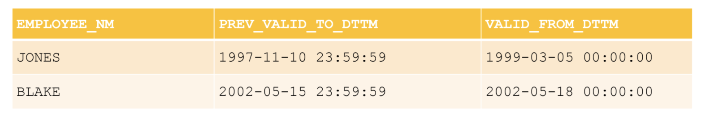

# Материалы

- [Лекция 6](https://drive.google.com/file/d/1BFimGg2vkaGahMY2ZeXcY0hW_6LLvOMk/view?usp=sharing)

# Теория

## SCD. Типы SCD. Работа с версионными таблицами

### SCD. Типы SCD

**SCD (Slowly Changing Dimension)** —  редко изменяющиеся измерения, то есть измерения, не ключевые атрибуты которых имеют тенденцию со временем изменяться.

Выделяют пять основных типов:

* **SCD 0**: после попадания в таблицу данные никогда  не изменяются — не поддерживает версионность. Практически никогда не используется.
* **SCD 1**: данные перезаписываются (всегда актуальные) — используется, если история не нужна.
    * _Достоинства:_
        * Не добавляет избыточность;
        * Очень простая структура.
    * _Недостатки:_
        * Не хранит историю.
* **SCD 2**: храним историю с помощью двух полей (дата начала действия, дата окончания действия: `valid_from`, `valid_to`) — _используется наиболее часто_.
    * _Достоинства:_
        * Хранит полную и неограниченную историю версий;
        * Удобный и простой доступ к данным необходимого периода.
    * _Недостатки:_
        * Провоцирует на избыточность или заведение доп. таблиц для хранения изменяемых атрибутов.


Вместо `NULL` используется некоторая константа (для `valid_to — '9999-12-31'`), что позволяет писать простое условие:
```sql
WHERE day_dt BETWEEN valid_from_dttm AND valid_to_dttm
```
вместо
```sql
WHERE day_dt >= valid_from_dttm
    AND (day_dt <= valid_to_dttm
        OR valid_to_dttm IS NULL)
```

* **SCD 3**: храним старое значение для выделенных атрибутов в отдельных полях. При получении новых данных старые данные перезаписываются текущими значениями.
    * _Достоинства:_
        * Небольшой объем данных;
        * Простой и быстрый доступ к истории.
    * _Недостатки:_
        * Ограниченная история.


* **SCD 4**: храним в основной таблице только актуальные данные и историю изменений в отдельной таблице. Основная таблица всегда перезаписывается текущими данными с перенесением старых данных в другую таблицу. Обычно этот тип используют для аудита изменений или создания архивных таблиц.
    * _Достоинства:_
        * Быстрая работа с текущими версиями
    * _Недостатки:_
        * Разделение единой сущности на разные таблицы


### Типовые задачи

* Поддержка версионности таблиц
* Соединение версионных таблицы
* Поиск разрывов в версионности
* Поиск пересечений в версионности
* Сравнение таблиц

#### Соединение версионных таблиц


**Как соединяем?**
1. Отделы в соединяемых записях должны совпадать:
```sql
    EMP_DEPT.DEPT_NO = DEPT.DEPT_NO
```
2. Конкретная строка из таблицы `EMP_DEPT` (исходная строка) должна соединяться только с теми строками таблицы DEPT (соединяемая строка), у которых период действия покрывает часть периода действия исходной строки:
```sql
    DEPT.START_DATE <= EMP_DEPT.END_DATE
    AND DEPT.END_DATE >= EMP_DEPT.START_DATE
```
3. Датой начала действия результирующего интервала должна быть максимальная дата из дат начала действия исходного и присоединяемого интервала:
```sql
    START_DATE = max(EMP_DEPT.START_DATE, DEPT.START_DATE)
```
4. Датой окончания действия результирующего интервала должна быть минимальная дата из дат окончания действия исходного и присоединяемого интервала:
```sql
    END_DATE = min(EMP_DEPT.END_DATE, DEPT.END_DATE)
```

```sql
SELECT emp_dept.emd_name
    , dept.dept_name
    , CASE
        WHEN emp_dept.start_date > dept.start_date
        THEN emp_dept.start_date
        ELSE dept.start_date
    END AS start_date
    , CASE
        WHEN emp_dept.end_date < dept.end_date
        THEN emp_dept.end_date
        ELSE dept.end_date
    END AS end_date
FROM emp_date
INNER JOIN dept
    ON emp_date.dept_no = dept.dept_no
    AND dept.start_date <= emp_dept.end_date
    AND dept.end_date >= emp_dept.start_date;
```

```sql
SELECT emp_dept.emd_name
    , dept.dept_name
    , greatest(emp_dept.start_date, dept.start_date) AS start_date
    , least(emp_dept.end_date, dept.end_date) AS end_date
FROM emp_date
INNER JOIN dept
    ON emp_date.dept_no = dept.dept_no
    AND dept.start_date <= emp_dept.end_date
    AND dept.end_date >= emp_dept.start_date;
```


#### Поиск разрывов в версионности


В таблице присутствуют 2 разрыва:
1. Для сотрудника 'JONES' нет информации о его работе в период с '1997-11-11' по '1999-03-04';
2. Для сотрудника 'BLAKE' нет информации о его работе в период с '2002-05-16' по '2002-05-17'.

Возможные причины:
* Логика исходных данных – сотрудник 'JONES' не работал в компании с '1997-11-11' по '1999-03-04'
* Ошибка ввода данных – у сотрудника 'BLAKE' неправильно введена дата начала его работы в отделе 3 или дата окончания его работы в отделе 2

**Как ищем разрывы?**
1. Используем аналитические функции;
2. Разбиваем данные на группы по ключу таблицы `EMPLOYEE_NM`
3. Отсортировываем данные в группах по дате начала действия интервала `VALID_FROM_DTTM`
4. Проверяем, превышает ли разница между датой начала действия текущего интервала и датой окончания действия предыдущего интервал в 1 секунду.

```sql
select employee_nm
    , prev_valid_to_dttm
    , valid_from_dttm
from (
    select employee_nm
        , lag(valid_to_dttm)
            over (partition by employee_nm
                order by valid_from_dttm) as prev_valid_to_dttm
        , valid_from_dttm
    from emp_dept
) t
where valid_from_dttm - prev_valid_to_dttm > interval '1 sec';
```



Так можем получить промежутки, в которых не хватает данных:

```sql
select employee_nm
    , prev_valid_to_dttm + interval '1 sec' as miss_valid_from_dttm
    , valid_from_dttm - interval '1 sec' as miss_valid_to_dttm
from (
    select employee_nm
    , lag(valid_to_dttm)
        over (partition by employee_nm
            order by valid_from_dttm) as prev_valid_to_dttm
    , valid_from_dttm
from emp_dept
) t
where valid_from_dttm – prev_valid_to_dttm > interval '1 sec';
```


### Поиск пересечений в версионности


В таблице присутствуют 2 пересечения:
1. Сотрудник 'JONES' работал в двух отделах в период с '1999-03-05' по '1999-07-20'
2. Сотрудник 'BLAKE' работал в двух отделах в период с '2002-05-18' по '2002-05-20'

**Как ищем пересечения?**
1. Используем аналитические функции;
2. Разбиваем данные на группы по ключу таблицы `EMPLOYEE_NM`
3. Отсортировываем данные в группах по дате начала действия интервала `VALID_FROM_DTTM`
4. Проверяем, не начинается ли период действия текущей записи раньше, чем заканчивается предыдущий интервал.

```sql
select employee_nm
    , prev_valid_from_dttm
    , prev_valid_to_dttm
    , valid_from_dttm
    , valid_to_dttm
from (
    select employee_nm
        , lag(valid_from_dttm)
            over (partition by employee_nm
                order by valid_from_dttm) as prev_valid_from_dttm,
        , lag(valid_to_dttm)
            over (partition by employee_nm
                order by valid_from_dttm) as prev_valid_to_dttm,
        , valid_from_dttm
        , valid_to_dttm
    from emp_dept
    ) t
where valid_from_dttm <= prev_valid_to_dttm;
```

*Примечание:*
* Можно решить эту задачу без аналитических функций простым соединением версионных таблиц
* Условия использования такого решения:
    * В качестве соединяемых таблиц будет выступать одна и та же таблица
    * Наличие возможности отличить любые две строки таблицы
    * Нет строк с одинаковым ключом и периодом действия

```sql
select e1.employee_name
    , e1. as prev_valid_from_dttm
    , e1.valid_to_dttm as prev_valid_to_dttm
    , e2.valid_from_dttm
    , e2.valid_to_dttm
from emp_dept e1
inner join emp_dept e2
    on e1.employee_nm = e2.employee_nm
    and e2.valid_from_dttm between e1.valid_from_dttm and e1.valid_to_dttm
    and e1.valid_to_dttm <> e2.valid_to_dttm;
```

## TCL, транзакции

**Транзакция** – это объект, группирующий последовательность операций, которые должны быть выполнены как единое целое.
Обеспечивает переход БД из одного целостного состояния в другое.


В качестве примера транзакции рассмотрим последовательность операций по приему заказа в коммерческой компании. Для
приема заказа от клиента приложение ввода заказов должно:

* выполнить запрос к таблице товаров и проверить наличие товара на складе;
* добавить заказ к таблице счетов;
* обновить таблицу товаров, вычтя заказанное количество товаров из количества товара, имеющегося в наличии;
* обновить таблицу продаж, добавив стоимость заказа к объему продаж служащего, принявшего заказ;
* обновить таблицу офисов, добавив стоимость заказа к объему продаж офиса, в котором работает данный служащий.

Транзакции обеспечивают целостность БД в условиях:

* Параллельной обработки данных
* Физических отказов диска
* Аварийного сбоя электропитания
* И других

Транзакции обладают 4 характеристиками, удовлетворяющими парадигме ACID:

1. Atomic – атомарные;
2. Consistent – согласованные;
3. Isolated – изолированные;
4. Durable – долговечные, устойчивые.

#### <ins>A</ins>CID – Атомарность транзакций (Atomicity)

* Транзакция должна представлять собой атомарную (неделимую) единицу работы;
* Должны быть выполнены либо все операции, входящие в транзакцию, либо ни одна из них;
* Следовательно, в случае невозможности выполнить все операции, все внесённые изменения должны быть отменены:
    * `COMMIT` – совершение транзакции
    * `ROLLBACK` – отмена транзакции

#### A<ins>C</ins>ID – Согласованность транзакций (Consistency)

* По завершению транзакции все данные должны остаться в согласованном состоянии
* При выполнении транзакции необходимо выполнить все правила реляционной СУБД:
    * Проверки выполнения ограничений (домены, индексы уникальности, внешние ключи, проверки, правила и т.д.)
    * Обновление индексов;
    * Выполнение триггеров
    * И другие

#### AC<ins>I</ins>D – Изоляция транзакций (Isolation)

* Изменения в данных, выполняемые в пределах транзакции, должны быть изолированы от всех изменений, выполняемых в других
  транзакциях, до тех пор, пока транзакция не совершена;
* Выделяют различные уровни изоляции – для достижения компромисса между степенью распараллеливания работы с БД и
  строгостью выполнения принципа непротиворечивости:
    * Чем выше уровень изоляции, тем выше степень непротиворечивости данных;
    * Чем выше уровень изоляции, тем ниже степень распараллеливания и тем ниже степень доступности данных.

Стандартная классификация проблем с уровнями изоляции:

* P1: dirty read – «грязное» чтение
* P2: non-repeatable read – невоспроизводимое чтение
* P3: phantom read – фантомное чтение

**P1 (dirty read, «грязное» чтение)**

1. Транзакция Т1 вносит изменения в ряд таблицы.
2. Т2 читает этот ряд после внесения изменений Т1, но до совершения Т1.
3. Если Т1 будет отменена, то данные, считанные Т2, будут некорректными.

```postgresql
-- T1
UPDATE Users
SET AGE = 21
WHERE Id = 1;

ROLLBACK;
```

```postgresql
-- T2
SELECT Age
FROM Users
WHERE Id = 1;
```

**P2 (non-repeatable read, невоспроизводимое чтение)**

1. Транзакция Т1 читает ряд.
2. Транзакция Т2 после этого вносит изменения в этот ряд или удаляет его.
3. Если Т1 после этого считает этот же ряд снова, то получит новый результат по сравнению с первым считыванием.

```postgresql
-- T1
SELECT *
FROM Users
WHERE Id = 1;
```

```postgresql
-- T2
UPDATE Users
SET AGE = 21
WHERE Id = 1;

COMMIT;
```

**P3 (phantom, фантомное чтение)**

1. Транзакция Т1 читает набор рядов N, удовлетворяющих некоторому условию.
2. После этого Т2 выполняет SQL запросы, создающие новые ряды, удовлетворяющие этому условию.
3. Если Т1 повторит запрос с тем же условием, то получит другой набор рядов.

```postgresql
-- T1
SELECT *
FROM Users
WHERE Age BETWEEN 10 AND 30;
```

```postgresql
-- T2
INSERT INTO Users (Name, Age)
VALUES (‘Bob’, 27);

COMMIT;
```

#### ACI<ins>D</ins> – Долговечность, устойчивость (прочность) транзакций (Durability)

* Если транзакия была совершена, её результат должен сохраниться в системе, несмотря на сбой системы;
* Если транзакиция не была совершена, её результат может быть полностью отменён вслед за сбоем системы.

### Transaction Control Language

```postgresql
BEGIN TRANSACTION transaction_mode [, ...]
   ISOLATION LEVEL { SERIALIZABLE | REPEATABLE READ | READ COMMITTED | READ UNCOMMITTED }
   READ WRITE | READ ONLY
   [NOT] DEFERRABLE

BEGIN / START
   COMMIT
   ROLLBACK

SAVEPOINT name
   ROLLBACK TO SAVEPOINT name
   RELEASE SAVEPOINT name
```

**Границы транзакций**

```postgresql
BEGIN;
INSERT ...;
UPDATE ...;
DELETE ...;
COMMIT;

BEGIN;
INSERT ...;
UPDATE ...;
DELETE ...;
ROLLBACK;
```

### Уровни изолированности транзакций ANSI SQL

В идеальном мире параллельные транзакции изолированны (идеально уживаются друг с другом в базе), но в реальном мире
такое невозможно. Характеристика соответствия базы свойству изолированности называется уровнем изолированности. Выделяют
4 уровня изолированности:


* **READ UNCOMMITTED**: помогает бороться с потерянными обновлениями при изменениях одного и того же блока данных
  несколькими транзакциями.
* **READ COMMITTED**: помогает бороться с чтением "грязных" данных, измененных впоследствии откатившейся транзакцией
* **REPEATABLE READ**: помогает бороться с изменением в данных при повторном чтении одного и того же блока данных в
  рамках одной транзакции
* **SERIALIZABLE**: аналогично **REPEATABLE READ**, но применимо к `INSERT`, а не `UPDATE`

---

<details>
  <summary>Если останется время</summary>

## Разграничение доступов PostgreSQL. Data Control Language (DCL)

### Разграничение доступов PostgreSQL

**Роль** – множество пользователей БД
* Может владеть объектами в базе
* Может иметь определенный доступ к некоторым объектам базы, не являясь их владельцем
* Может выдавать доступы на некоторые объекты в базе другим ролям
* Может предоставлять членство в роли другой роли

**Создание пользователя**

```sql
CREATE USER == CREATE ROLE

CREATE USER name [[WITH] option [...]]
where option can be:
SUPERUSER | NOSUPERUSER
| CREATEDB | NOCREATEDB
| CREATEROLE | NOCREATEROLE
| INHERIT | NOINHERIT
| LOGIN | NOLOGIN
| REPLICATION | NOREPLICATION
| BYPASSRLS | NOBYPASSRLS
| CONNECTION LIMIT connlimit
| [ENCRYPTED] PASSWORD 'password' | PASSWORD NULL
| VALID UNTIL 'timestamp'
| IN ROLE role_name [, ...]
| IN GROUP role_name [, ...]
| ROLE role_name [, ...]
| ADMIN role_name [, ...]
| USER role_name [, ...]
| SYSID uid
```

```sql
CREATE ROLE jonathan LOGIN;

CREATE USER davide
WITH PASSWORD 'jw8s0F4';

CREATE ROLE Miriam
WITH LOGIN PASSWORD 'jw8s0F4'
VALID UNTIL '2005-01-01';
```

### Data Control Language (DCL)

* Позволяет настраивать доступы к объектам
* Поддерживает 2 типа действий:
    * `GRANT` – выдача доступа к объекту
    * `REVOKE` – отмена доступа к объекту

**Права, которые можно выдать на объект:**
* SELECT
* INSERT
* UPDATE
* DELETE
* TRUNCATE
* REFERENCES
* TRIGGER
* CREATE
* CONNECT
* TEMPORARY
* EXECUTE
* USAGE

[**GRANT ON TABLE**](https://postgrespro.ru/docs/postgresql/9.6/sql-grant)
```sql
GRANT {{SELECT | INSERT | UPDATE | DELETE | TRUNCATE |
    REFERENCES | TRIGGER}
[, ...] | ALL [PRIVILEGES]}
ON {[ TABLE] table_name [, ...]
    | ALL TABLES IN SCHEMA schema_name [, ...]}
TO role_specification [, ...] [WITH GRANT OPTION]
```

[**REVOKE ON TABLE**](https://postgrespro.ru/docs/postgresql/9.6/sql-revoke)

```sql
REVOKE [GRANT OPTION FOR]
    {{SELECT | INSERT | UPDATE | DELETE | TRUNCATE |
        REFERENCES | TRIGGER}
[, ...] | ALL [PRIVILEGES]}
ON {[TABLE] table_name [, ...]
    | ALL TABLES IN SCHEMA schema_name [, ...]}
FROM {[GROUP] role_name | PUBLIC} [, ...]
[CASCADE | RESTRICT]
```

```sql
GRANT ALL PRIVILEGES ON kinds TO manuel;
REVOKE ALL PRIVILEGES ON kinds FROM manuel;

GRANT SELECT ON kinds TO manuel WITH GRANT OPTION; -- manuel может выдавать права на SELECT на табличку kinds
```

*Примечание:* Если мы хотим забрать `grant option` у `manuel`, то нужно использовать `CASCADE`, чтобы забрать права у всех, кому он выдавал права. Иначе при попытке отозвать права у `manuel`, запрос упадет с ошибкой.

**Примеры использования:**

```sql
CREATE USER davide WITH PASSWORD 'jw8s0F4';

GRANT CONNECT ON DATABASE db_prod TO davide;

GRANT USAGE ON SCHEMA my_schema TO davide;

GRANT ALL PRIVILEGES ON ALL TABLES IN SCHEMA my_schema
TO davide;
```

</details>

---

# Практика
## Transaction control language

1. Создать схему seminar_6:

```postgresql
CREATE SCHEMA seminar_6;
```

2. Создать таблицу:

```postgresql
CREATE TABLE seminar_6.test_table (
    my_id         SERIAL,
    my_text_filed TEXT
);
```

3. Открыть новую транзакцию в явном виде. Запустить операцию вставки

```postgresql
INSERT INTO seminar_6.test_table (my_text_filed) VALUES (’test_value1’);
```

Не завершая транзакцию, проверить, что данные в таблицу вставились. Обратить внимание на значение в поле `my_id`.

4. В новой консоли написать запрос на получение всех строк таблицы, созданной в п.2. Объясните, почему так вышло.
   Закоммитьте изменения в консоли 1.

5. В обеих консолях откройте новые транзакции.

* Напишите в первой консоли апдейт к единственной строке таблицы. Проверьте, что первая транзакция видит изменения.
* Во второй консоли запустите операцию апдейта к той же строке. Подумайте, что произошло и почему?
* Сохраните изменения в первой консоли. Что произошло со второй консолью?
* Сохраните изменения во второй консоли.

6. Повторите предыдущее упражнение с использованием уровня repeatable read. Что произошло при попытке закоммитить
   изменения первой открытой транзакцией? Откатите обе транзакции.

7. Для получения дефолтного значения уровня изолированности транзакций в вашем постгрес воспользуйтесь командой:

```postgresql
SHOW default_transaction_isolation;
```

Объясните разницу в поведении транзакций в задачах 6 и 7, воспользовавшись новым знанием.

8. Повторите задачу 5, используя оператор вставки данных, а не обновления, по аналогии с п.3. Посмотрите на значение в
   поле `my_id` после вставки второй транзакцией.

9. В обеих консолях откройте новые транзакции уровня serializable

* Первой транзакцией считайте данные из таблицы.
* Второй транзакцией осуществите вставку в таблицу новых данных. И сразу же примените изменения.
* Снова считайте данные первой транзакцией. Что произошло?
* Попробуйте добавить в таблицу данные с использованием первой транзакции. Что произошло? Откатите изменения.

10. Откройте новую транзакцию в любой консоли, уровень изолированности не имеет значения.

* Добавьте в таблицу несколько строк.
* Создайте точку останова (savepoint) и посмотрите на значения в таблице.
* Снова добавьте в таблицу несколько строк, создайте точку останова и посмотрите на строки в таблице.
* Добавьте в таблицу еще одну строк и посмотрите на таблицу.
* Откатитесь ко второй точке останова и посмотрите на данные.
* Откатитесь к первой точке останова и посмотрите на данные.
* Откатите всю транзакцию.
