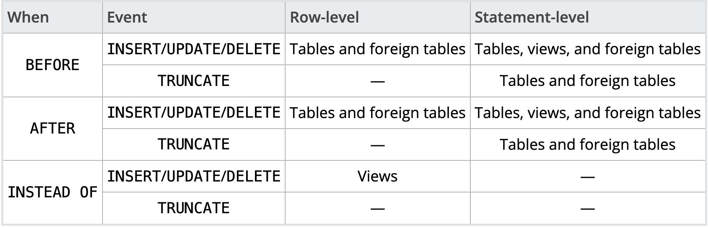

# Материалы

- [Лекция 9](https://drive.google.com/file/d/1dDhL3Ygao1Aewd5MZEeKyJtmrmaLH8te/view?usp=sharing)
- [Структура PL/pgSQL](https://postgrespro.ru/docs/postgresql/14/plpgsql-structure)
- [Создание функций](https://postgrespro.ru/docs/postgresql/14/sql-createfunction)
- [Строковые константы, заключённые в доллары](https://postgrespro.ru/docs/postgresql/14/sql-syntax-lexical#SQL-SYNTAX-DOLLAR-QUOTING)
- [Управление транзакциями](https://postgrespro.ru/docs/postgresql/14/plpgsql-transactions)
- [Обработка ошибок](https://postgrespro.ru/docs/postgresql/14/plpgsql-control-structures#PLPGSQL-ERROR-TRAPPING)
- [Обзор механизма работы триггеров](https://postgrespro.ru/docs/postgresql/14/trigger-definition)


# Теория

## Триггеры

### Введение

**Хранимый код** – объект базы данных, представляющий собой набор SQL-инструкций (и не только их), который компилируется один раз и
хранится на сервере.

**Зачем нужен хранимый код?**

* скрывают алгоритмы обработки данных;
* расширяют возможности программирования, позволяя реализовывать сложную логику;
* поддерживают функции безопасности и целостности данных, обработку исключений.

PostgreSQL позволяет разрабатывать собственный хранимый код и на языках, отличных от SQL 
([на C также](https://www.postgresql.org/docs/current/xfunc-c.html), но в рамках курса не рассматриваем). 
Эти другие языки в целом обычно называются процедурными языками (PL, Procedural Languages). 
Процедурные языки не встроены в сервер PostgreSQL; они предлагаются загружаемыми модулями:
 * [PL/pgSQL](https://www.postgresql.org/docs/current/plpgsql.html)
 * [PL/Tcl](https://www.postgresql.org/docs/current/pltcl.html)
 * [PL/Perl](https://www.postgresql.org/docs/current/plperl.html)
 * [PL/Python](https://www.postgresql.org/docs/current/plpython.html)

**PL/pgSQL** — язык программирования, используемый для написания хранимого кода для PostgreSQL. С помощью данного
расширения PostgreSQL можно писать выполняемые блоки, функции и особый объект баз данных – триггеры.  

Помимо PL/pgSQL мы также попишем на PL/Python.

### Функции

PostgreSQL предоставляет большое количество функций для встроенных типов данных. 
Например, функция повторения строки:
```postgresql
repeat ( text, integer ) → text
```
(правая стрелочка обозначает результат выполнения функции)
```postgresql
repeat('Pg', 4) → 'PgPgPgPg'
```

Собственные функции определяются на сервере командами `CREATE FUNCTION`. Такая команда обычно выглядит,
например, так:

```postgresql
CREATE FUNCTION somefunc(integer, text) RETURNS integer
AS 'тело функции'
LANGUAGE [SQL|plpgsql|plpython|...];
```

> **Примечание!**
>
> Если рассматривать `CREATE FUNCTION`, тело функции представляет собой просто текстовую строку.
Часто для написания тела функции удобнее заключать эту строку в доллары, а не в обычные апострофы.
Если не применять заключение в доллары, все апострофы или обратные косые черты в теле функции придётся экранировать, дублируя их.

**Строковые константы** в долларах можно вкладывать друг в друга, выбирая на разных уровнях вложенности разные теги. Чаще
всего это используется при написании определений функций. Например:

```postgresql
$function$
BEGIN
    RETURN ($1 ~ $q$[\t\r\n\v\\]$q$);
END;
$function$
```

#### Функции на SQL

Простейший вариант функций на языке запросов (функции, написанные на SQL). 
Достаточно взглянуть на несколько примеров, чтобы понять что к чему:

```postgresql
-- Пример №1
CREATE FUNCTION add(integer, integer) 
RETURNS integer
AS 'SELECT $1 + $2;'
LANGUAGE SQL;

---- Запрос
SELECT add(1, 3);

--- Ответ
| add |
-------
|  4  |
```

```postgresql
-- Пример №2
CREATE FUNCTION dup(in int, out f1 int, out f2 text)
AS $$ SELECT $1, CAST($1 AS text) || ' is text' $$
LANGUAGE SQL;

---- Запрос
SELECT * FROM dup(42);

--- Ответ
| f1   | f2         |
---------------------
|   42 | 42 is text |
```

#### Функции на PL/pgSQL.

**PL/pgSQL** это блочно-структурированный язык. Текст тела функции должен быть блоком. Структура блока:

```postgresql
[ <<метка>> ]
[ DECLARE
    объявления ]
BEGIN
    операторы
END [ метка ];
```

Каждое объявление и каждый оператор в блоке должны завершаться символом «;» (точка с запятой). Блок, вложенный в другой
блок, должен иметь точку с запятой после END, как показано выше. Однако финальный `END`, завершающий тело функции, не
требует точки с запятой.

> Примечание!
>
>Распространённой ошибкой является добавление точки с запятой сразу после `BEGIN`.
Это неправильно и приведёт к синтаксической ошибке.

Метка требуется только тогда, когда нужно идентифицировать блок в операторе `EXIT`, или дополнить имена переменных,
объявленных в этом блоке. Если метка указана после `END`, то она должна совпадать с меткой в начале блока.

Ключевые слова не чувствительны к регистру символов. Как и в обычных SQL-командах, идентификаторы неявно преобразуются к
нижнему регистру, если они не взяты в двойные кавычки.

Комментарии в **PL/pgSQL** коде работают так же, как и в обычном SQL. Двойное тире `--` начинает комментарий, который
завершается в конце строки. Блочный комментарий начинается с `/*` и завершается `*/`. Блочные комментарии могут быть
вложенными.

Любой оператор в выполняемой секции блока может быть вложенным блоком. Вложенные блоки используются для логической
группировки нескольких операторов или локализации области действия переменных для группы операторов. Во время выполнения
вложенного блока переменные, объявленные в нём, скрывают переменные внешних блоков с такими же именами. Чтобы получить
доступ к внешним переменным, нужно дополнить их имена меткой блока. Например:

```postgresql
CREATE FUNCTION somefunc() RETURNS integer AS $$
<< outerblock >>
DECLARE
    quantity integer := 30;
BEGIN
    RAISE NOTICE 'Сейчас quantity = %', quantity;  -- Выводится 30
    quantity := 50;
    --
    -- Вложенный блок
    --
    DECLARE
        quantity integer := 80;
    BEGIN
        RAISE NOTICE 'Сейчас quantity = %', quantity;  -- Выводится 80
        RAISE NOTICE 'Во внешнем блоке quantity = %', outerblock.quantity;  -- Выводится 50
    END;

    RAISE NOTICE 'Сейчас quantity = %', quantity;  -- Выводится 50

    RETURN quantity;
END;
$$ LANGUAGE plpgsql;
```

> Примечание
>
> Существует скрытый «внешний блок», окружающий тело каждой функции на **PL/pgSQL**. Этот блок содержит объявления
параметров функции (если они есть), а также некоторые специальные переменные, такие как `FOUND`.
Этот блок имеет метку, совпадающую с именем функции, таким образом, параметры и специальные переменные могут быть
дополнены именем функции.

Важно не путать использование `BEGIN/END` для группировки операторов в **PL/pgSQL** с одноимёнными SQL-командами для
управления транзакциями. `BEGIN/END` в **PL/pgSQL** служат только для группировки предложений; они не начинают и не
заканчивают транзакции. Про управление транзакциями в **PL/pgSQL** можно почитать в документации[^4]. Кроме того, блок с
предложением `EXCEPTION` по сути создаёт вложенную транзакцию, которую можно отменить, не затрагивая внешнюю транзакцию.
Подробнее обработка ошибок описана в документации.

#### Функции на PL/Python.

Прежде чем что-то использовать, это надо установить.
если вы используете контейнер c `postgres` поверх `apline` скачайте пакеты:
```bash
apk add --no-cache --virtual .plpython3-deps --repository http://nl.alpinelinux.org/alpine/edge/testing \
    postgresql-plpython3 \
    && ln -s /usr/lib/postgresql/plpython3.so /usr/local/lib/postgresql/plpython3.so \
    && ln -s /usr/share/postgresql/extension/plpython3u.control /usr/local/share/postgresql/extension/plpython3u.control \
    && ln -s /usr/share/postgresql/extension/plpython3u--1.0.sql /usr/local/share/postgresql/extension/plpython3u--1.0.sql \
    && ln -s /usr/share/postgresql/extension/plpython3u--unpackaged--1.0.sql /usr/local/share/postgresql/extension/plpython3u--unpackaged--1.0.sql
```

После необходимо установить `PL/Python` в определённую базу данных, выполните команду:
```postgresql
CREATE EXTENSION plpython3u; -- будем использовать Python3
```

Функции на `PL/Python` объявляются стандартным образом с помощью команды `CREATE FUNCTION`:
```postgresql
CREATE FUNCTION funcname (argument-list)
  RETURNS return-type
AS $$
  # Тело функции на PL/Python
$$ LANGUAGE plpython3u;
```

Тело функции содержит просто скрипт на языке Python. Когда вызывается функция, её аргументы передаются в виде элементов списка args; именованные аргументы также передаются скрипту Python как обычные переменные. С применением именованных аргументов скрипт обычно лучше читается. Результат из кода Python возвращается обычным способом, командой `return` или `yield` (в случае функции, возвращающей множество). Если возвращаемое значение не определено, Python возвращает `None`. Исполнитель PL/Python преобразует `None` языка Python в значение `NULL` языка SQL.

Например, функцию, возвращающее большее из двух целых чисел, можно определить так:
```postgresql
CREATE FUNCTION pymax (a integer, b integer)
  RETURNS integer
AS $$
  if a > b:
    return a
  return b
$$ LANGUAGE plpython3u;
```

Значения аргументов задаются в глобальных переменных. Согласно правилам видимости в Python, тонким следствием этого является то, что переменной аргумента нельзя присвоить внутри функции выражение, включающее имя самой этой переменной, если только эта переменная не объявлена глобальной в текущем блоке. Например, следующий код не будет работать:
```postgresql
CREATE FUNCTION pystrip(x text)
  RETURNS text
AS $$
  x = x.strip()  # ошибка
  return x
$$ LANGUAGE plpython3u;
```

так как присвоение x значения делает x локальной переменной для всего блока, и при этом x в правой части присваивания оказывается ещё не определённой локальной переменной x, а не параметром функции PL/Python. Добавив оператор `global`, это можно исправить:
```postgresql
CREATE FUNCTION pystrip(x text)
  RETURNS text
AS $$
  global x
  x = x.strip()  # теперь всё в порядке
  return x
$$ LANGUAGE plpython3u;
```

Полезные ссылки по PL/Python:
 * [Про типы и их взаимную конвертацию](https://postgrespro.ru/docs/postgresql/9.6/plpython-data)
 * [Анонимные блоки кода](https://postgrespro.ru/docs/postgresql/9.6/plpython-do)
 * [Обращение к данным базы данных](https://postgrespro.ru/docs/postgresql/9.6/plpython-database)
 * [Вспомагательные функции](https://postgrespro.ru/docs/postgresql/9.6/plpython-util)

### Function Volatility Categories

Каждая функция имеет свою степень/категорию волатильности: `VOLATILE`, `STABLE`, `IMMUTABLE`. 
`VOLATILE` значение по умолчанию в `CREATE FUNCTION` в команде. Степень волатильности является контрактом
для оптимизатора про поведение функции:

 * `VOLATILE` функция не дает никаких гарантий о своем поведении: поведение может быть недетерминированно при одинаковых аргументах, модифицировать внутренне состояние базы данных, ... . Оптимизатор не делает никаких предположений касаемо поведения такой функции. Запросы, использующие `VOLATILE` функции будут пересчитывать значение функции на каждой применяемой строке таблицы.

 * `STABLE` функция дает гарантию, что не модифицирует внутреннее состояние базы и гарантирует детерминированное поведение на одних и тех же аргументах **в рамках одного запроса**. Поэтому данная степень волатильности позволяет оптимизировать множественные вызовы путем кеширования. В частности, такие функции можно использовать для поиска по индексу (для `VOLATILE` такое запрещено).

 * `IMMUTABLE` функция дает те же гарантии что и `STABLE`, но снимает ограничение на рамки одного запроса. Поэтому оптимизатор может предварительно "прогреть кэш" на константных аргументах.

Для лучшей эксплуатации оптимизатора следует использовать ту допустимую категорию, которая дает больше гарантий о своем поведении.

Функции модифицирующие состояние БД должны быть обозначены как `VOLATILE`. Функции типа `random()`, `currval()`, `timeofday()` должны быть также обозначены `VOLATILE`.

### Процедуры.

__Процедура__ — объект базы данных, подобный функции, но имеющий следующие отличия:
 * Процедуры определяются командой `CREATE PROCEDURE`, а не `CREATE FUNCTION`. 
 * Процедуры, в отличие от функций, не возвращают значение; поэтому в `CREATE PROCEDURE` отсутствует предложение `RETURNS`. Однако процедуры могут выдавать данные в вызывающий код через выходные параметры. 
 * Функции вызываются как часть запроса или команды DML, а процедуры вызываются отдельно командой `CALL`. 
 * Процедура, в отличие от функции, может фиксировать или откатывать транзакции во время её выполнения (а затем автоматически начинать новую транзакцию), если вызывающая команда `CALL` находится не в явном блоке транзакции. 
 * Некоторые атрибуты функций (например, `STRICT`) неприменимы к процедурам. Эти атрибуты влияют на вызов функций в запросах и не имеют отношения к процедурам.

**Пример**:

```postgresql
CREATE PROCEDURE insert_data(a integer, b integer)
LANGUAGE SQL -- можно также использовать процедурные языки
AS $$
  INSERT INTO tbl VALUES (a);
  INSERT INTO tbl VALUES (b);
$$;
```

```postgresql
CALL insert_data(1, 2);
```

### Триггеры.

**Триггер** — хранимая процедура особого типа, которую пользователь не вызывает непосредственно, а исполнение которой
обусловлено действием по модификации данных: добавлением `INSERT`, удалением `DELETE` строки в заданной таблице, или
изменением UPDATE данных в определённом столбце заданной таблицы реляционной базы данных.

Могут выполняться до / вместо / после основного действия и для всей строки / всего выражения модификации данных.




**Алгоритм создания триггера:**

1. Создание хранимой функции, которая возвращает специальный тип `TRIGGER`
2. Создание непосредственно триггера, который запускает функцию из п.1

**Функции для триггеров:**

* Не принимают ничего на вход
* Возвращают тип `trigger`
* Могут использовать специальные атрибуты вида `TG_variable`

**Специальные переменные для использования в триггерах:**

* `NEW` – переменная типа `RECORD`, содержащая новую строку `UPDATE` / `INSERT` операций. `NULL` для `DELETE`
* `OLD` – переменная типа `RECORD`, содержащая старую строку `UPDATE` / `DELETE` операций. `NULL` для `INSERT`
* `TG_WHEN` – переменная типа `TEXT`, указывающая на время срабатывания триггера: `BEFORE`, `AFTER`, `INSTEAD OF`
* `TG_LEVEL` – переменная типа `TEXT`, соответствующая типу триггера по уровню срабатывания: `ROW`, `STATEMENT`
* `TG_OP` – переменная типа `TEXT`, соответствующая типу операции, на которую был вызван триггер: `INSERT`, `DELETE`
  , `UPDATE`, `TRUNCATE`
* `TG_TABLE_NAME` – переменная типа `NAME`, соответствующая таблице, которая вызвала срабатывание триггера
* `TG_TABLE_SCHEMA` – переменная типа `NAME`, соответствующая схеме, в которой хранится таблица, которая вызвала
  срабатывание триггера

**Синтаксис создания триггера:**

```postgresql
CREATE [ CONSTRAINT ] TRIGGER name { BEFORE | AFTER | INSTEAD OF } { event [ OR ... ] } 
    ON table_name
    [ FOR [ EACH ] { ROW | STATEMENT } ]
    [ WHEN ( condition ) ]
    EXECUTE { FUNCTION | PROCEDURE } function_name ( arguments )

where event can be one of:
    
    INSERT
    UPDATE [ OF column_name [, ... ] ] DELETE
    TRUNCATE
```

**Пример:**

```postgresql
CREATE TRIGGER log_update
    AFTER UPDATE ON accounts
    FOR EACH ROW
    WHEN (OLD.* IS DISTINCT FROM NEW.*)
    EXECUTE FUNCTION log_account_update();
```

Триггеры создаются вне схем, в привязке к конкретной таблице базы данных. Удаляются тоже с указанием таблицы, на которую
триггер создавался:

```postgresql
DROP TRIGGER [ IF EXISTS ] name ON table_name [ CASCADE | RESTRICT ]
```

---

# Практика
## Функции

1. Требуется написать функцию, которая будет выводить на экран фразу «Hello, World!».
2. Требуется написать функцию, которая будет переворачивать строку, получаемую на вход;
3. Требуется написать функцию, которая будет рассчитывать факториал заданного числа;
4. Требуется написать функцию, которая будет прибавлять к дате в формате `YYYY-MM-DD` n дней;
5. Требуется написать код, который создаст копии всех имеющихся таблиц вашей БД какой-либо схемы, например, добавив к
   ним суффикс `copy`.

---

## Триггеры

Пусть дана таблица `employee`, в которой содержится информация о сотрудниках и их зарплате, а также информация о том, кто
и когда в последний раз менял запись (создайте и наполните ее самостоятельно):

1. Требуется создать триггер, который при любом добавлении или изменении строки в таблице сохраняет в этой строке
   информацию о текущем пользователе и отметку времени. Кроме того, он требует, чтобы было указано имя сотрудника и
   зарплата задавалась положительным числом.

```sql
CREATE SCHEMA seminar_9;
CREATE TABLE seminar_9.employee
(
	emp_name text,
	salary int,
	update_dt timestamp,
	update_usr_id text  DEFAULT '0'
);

insert into seminar_9.employee values ('Петр Болотин', 100000);
insert into seminar_9.employee values ('Михеева Татьяна', 100500);
insert into seminar_9.employee values ('Кто Это', 42000);
```

2. Создать триггер, который будет записывать все изменения таблицы `employee` в отдельную таблицу логов. Информация,
   которая должна быть отражена в таблице логов:
    * какая операция была совершена;
    * время операции;
    * пользователь, который совершил операцию;
    * значения новых полей.
