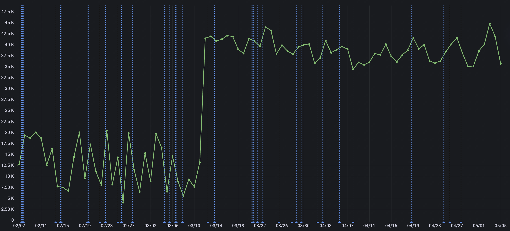

# Материалы

- [Лекция 12](https://drive.google.com/file/d/1M1j9WWftZTreXu50q-dINPPrQLfdK_wF/view?usp=sharing)
- Документация:
  - [JSON в PostgreSQL](https://postgrespro.ru/docs/postgrespro/9.5/functions-json)
  - [Sequence](https://postgrespro.ru/docs/postgresql/9.6/sql-createsequence)
  - ClickHouse
    - [Репликация данных](https://clickhouse.com/docs/ru/engines/table-engines/mergetree-family/replication)
    - [MergeTree движок](https://clickhouse.com/docs/ru/engines/table-engines/mergetree-family/mergetree)
    - [Distributed движок](https://clickhouse.com/docs/ru/engines/table-engines/special/distributed)

# Теория

## Postgres

### Работа с JSON в SQL

**Операторы для типов json и jsonb**

- `json` – JavaScript Object Notation, Запись объекта JavaScript.
- `jsonb` – Binary JSON, представляет собой формат хранения данных в бинарном
  виде.

| Оператор | Тип правого операнда | Описание                                                                                 | Пример                                             | Результат примера |
| -------- | -------------------- | ---------------------------------------------------------------------------------------- | -------------------------------------------------- | ----------------- |
| `->`     | int                  | Выдаёт элемент массива JSON (по номеру от 0, отрицательные числа задают позиции с конца) | `'[{"a":"foo"},{"b":"bar"},{"c":"baz"}]'::json->2` | `{"c":"baz"}`     |
| `->`     | text                 | Выдаёт поле объекта JSON по ключу                                                        | `'{"a": {"b":"foo"}}'::json->'a'`                  | `{"b":"foo"}`     |
| `->>`    | int                  | Выдаёт элемент массива JSON в типе text                                                  | `'[1,2,3]'::json->>2`                              | `3`               |
| `->>`    | text                 | Выдаёт поле объекта JSON в типе text                                                     | `'{"a":1,"b":2}'::json->>'b'`                      | `2`               |
| `#>`     | text[]               | Выдаёт объект JSON по заданному пути                                                     | `'{"a": {"b":{"c": "foo"}}}'::json#>'{a,b}'`       | `{"c": "foo"}`    |
| `#>>`    | text[]               | Выдаёт объект JSON по заданному пути в типе text                                         | `'{"a":[1,2,3],"b":[4,5,6]}'::json#>>'{a,2}'`      | `3`               |

**Дополнительные операторы jsonb**

| Оператор                  | Тип правого операнда | Описание                                                                                                                                                        | Пример                                                    |
| ------------------------- | -------------------- | --------------------------------------------------------------------------------------------------------------------------------------------------------------- | --------------------------------------------------------- |
| `@>`                      | jsonb                | Левое значение JSON содержит на верхнем уровне путь/значение JSON справа?                                                                                       | `'{"a":1, "b":2}'::jsonb @> '{"b":2}'::jsonb`             |
| `<@`                      | jsonb                | Путь/значение JSON слева содержится на верхнем уровне в правом значении JSON?                                                                                   | `'{"b":2}'::jsonb <@ '{"a":1, "b":2}'::jsonb`             |
| `?`                       | text                 | Присутствует ли строка в качестве ключа верхнего уровня в значении JSON?                                                                                        | `'{"a":1, "b":2}'::jsonb ? 'b'`                           |
| <code>?&#124;</code>      | text[]               | Какие-либо строки массива присутствуют в качестве ключей верхнего уровня?                                                                                       | `'{"a":1, "b":2, "c":3}'::jsonb operator array['b', 'c']` |
| `?&`                      | text[]               | Все строки массива присутствуют в качестве ключей верхнего уровня?                                                                                              | `'["a", "b"]'::jsonb ?& array['a', 'b']`                  |
| <code>&#124;&#124;</code> | jsonb                | Соединяет два значения jsonb в новое значение jsonb                                                                                                             | `'["a", "b"]'::jsonb operator '["c", "d"]'::jsonb`        |
| `-`                       | text                 | Удаляет пару ключ/значение или элемент-строку из левого операнда. Пары ключ/значение выбираются по значению ключа.                                              | `'{"a": "b"}'::jsonb - 'a'`                               |
| `-`                       | integer              | Удаляет из массива элемент в заданной позиции (отрицательные номера позиций отсчитываются от конца). Выдаёт ошибку, если контейнер верхнего уровня — не массив. | `'["a", "b"]'::jsonb - 1`                                 |
| `#-`                      | text[]               | Удаляет поле или элемент с заданным путём (для массивов JSON отрицательные номера позиций отсчитываются от конца)                                               | `'["a", {"b":1}]'::jsonb #- '{1,b}'`                      |

Больше функций в
[документации](https://postgrespro.ru/docs/postgrespro/9.5/functions-json).

**Пример**

1. Создадим таблицу с полем типа json:
   ```sql
   CREATE TABLE orders
   (
       id   serial NOT NULL PRIMARY KEY,
       data json  NOT NULL
   );
   ```
2. Наполним её данными:
   ```sql
   insert into orders (data)
   values (
              '{ "customer": "John Doe", "items": {"product": "Beer","qty": 3}}'
          ),
          (
              '{ "customer": "Lily Bush", "items": {"product": "Diaper","qty": 24}}'
          ),
          (
              '{ "customer": "Josh William", "items": {"product": "Toy Car","qty": 1}}'
          ),
          (
              '{ "customer": "Mary Clark", "items": {"product": "Toy Train","qty": 2}}'
          );
   ```
3. Получим все имена клиентов:
   ```sql
   select data->'customer' as customer
   from orders;
   ```
4. Получим список продуктов:
   ```sql
   select data->'items'->>'product' as product
   from orders
   order by product;
   ```
5. Узнаем минимальное, максимальное, среднее и суммарное количество заказанных
   товаров:
   ```sql
   -- обратите внимание на каст к инту
   select min((data -> 'items' ->> 'qty')::int),
          max((data -> 'items' ->> 'qty')::int),
          avg((data -> 'items' ->> 'qty')::int),
          sum((data -> 'items' ->> 'qty')::int)
   from orders;
   ```

### Последовательности (sequences)

**Команды:**

- `CREATE SEQUENCE` отвечает за создание генератора последовательности.
- `DROP SEQUENCE` отвечает за удаление последовательности.
- `nextval()` позволяет получить следующий элемент последовательности.
- `currval()` позволяет получить текущий элемент последовательности.

**Синтаксис**

```sql
CREATE [ TEMPORARY | TEMP ] SEQUENCE [ IF NOT EXISTS ] имя [ INCREMENT [ BY ] шаг ]
    [ MINVALUE мин_значение | NO MINVALUE ] [ MAXVALUE макс_значение | NO MAXVALUE ]
    [ START [ WITH ] начало ] [ CACHE кеш ] [ [ NO ] CYCLE ]
    [ OWNED BY { имя_таблицы.имя_столбца | NONE } ]
```

**Пример**

1. Создадим последовательность:

   ```sql
   CREATE SEQUENCE id_seq AS INT
   START WITH 10
   INCREMENT BY 1
   CACHE 50
   ```

2. Возьмём следующий по порядку элемент:

   ```sql
   select nextval('id_seq');
   ---
   10
   ```

   ```sql
   select nextval('id_seq');
   ---
   11
   ```

3. Посмотрим на текущий элемент последовательности:
   ```sql
   select currval('id_seq');
   ---
   11
   ```
4. Сдвинем текущий элемент последовательности до 100 и проверим следующий:

   ```sql
   select setval('id_seq', 100);
   ---
   100
   ```

   ```sql
   select nextval('id_seq', 100);
   ---
   101
   ```

5. Создадим таблицу:
   1. С обычным `id`:
   ```sql
   CREATE TABLE superheroes(
   id INT PRIMARY KEY GENERATED BY DEFAULT AS IDENTITY,
    name VARCHAR(100),
    align VARCHAR(30),
    eye VARCHAR(30),
    hair VARCHAR(30),
    gender VARCHAR(30),
    appearances INT,
    year INT,
    universe VARCHAR(10)
   );
   ```
   2. С использованием последовательности в качестве генератора `id`:
   ```sql
   CREATE TABLE superheroes(
       id INT PRIMARY KEY GENERATED BY DEFAULT AS IDENTITY
       (START WITH 10 INCREMENT BY 10),
         name VARCHAR(100),
         align VARCHAR(30),
         eye VARCHAR(30),
         hair VARCHAR(30),
         gender VARCHAR(30),
         appearances INT,
         year INT,
         universe VARCHAR(10)
   );
   ```

## Масштабирование на примере ClickHouse

### Настройки кластера

- **Хост** – изолированная среда базы данных в облачной инфраструктуре с
  выделенными вычислительными ресурсами и зарезервированным объемом хранилища
  данных.
- **Шард** – набор некоторых хостов, которые повторяют логику хранения данных
  внутри шарда.
- **Кластер** (в терминах ClickHouse) – набор шардов. Кластеров для одного и
  того же набора хостов может быть несколько.
- **Реплика** – копия другого хоста внутри шарда.


Настройки структуры кластера задаются пользователем.

### Шардирование и репликация

**Шардирование** – способ разбиения исходных данных для более оптимального
чтения.

**Способы разбиения**

- **Построчное шардирование**
  - Внутри хоста или сервера – **партиционирование**; пример: партиционированная
    по дням таблица.
  - Внутри кластера – **горизонтальное шардирование**; пример: разделение данных
    по разным шардам.
- **Поколоночное (вертикальное) шардирование**
  - В ClickHouse – способ хранения по умолчанию во всех таблицах семейства
    MergeTree.

**Репликация** – способ дублирования данных для создания отказоустойчивой
системы и снижения нагрузки на отдельные хосты.

Системная информация о структуре кластеров базы хранится в таблице
`system.clusters`.

## Создание таблицы на кластере

**Пример 1**

```sql
CREATE TABLE table_name [ON CLUSTER analytics] (
    x UInt32
) ENGINE = ReplicatedMergeTree('/clickhouse/tables/{shard}/{database}/table_name', '{replica}')
ORDER BY x;
```

Ключевое слово `ON CLUSTER` отправляет запрос на исполнение на все **хосты**,
перечисленные при создании кластера.

**_Кейс._**

Вывод таблички `system.clusters` (с некоторыми опущенными колонками):

| cluster   | shard_num | shard_weight | replica_num | host_name                    |
| --------- | --------- | ------------ | ----------- | ---------------------------- |
| nodes     | 1         | 1            | 1           | search-analytics-1-123.ya.ru |
| nodes     | 1         | 1            | 2           | search-analytics-2-123.ya.ru |
| nodes     | 2         | 1            | 1           | search-analytics-3-123.ya.ru |
| nodes     | 2         | 1            | 2           | search-analytics-4-123.ya.ru |
| analytics | 1         | 1            | 1           | search-analytics-1-123.ya.ru |
| analytics | 1         | 1            | 2           | search-analytics-2-123.ya.ru |
| analytics | 2         | 1            | 1           | search-analytics-3-123.ya.ru |
| analytics | 2         | 1            | 2           | search-analytics-4-123.ya.ru |

Есть ли разница, создавать табличку с `ON CLUSTER nodes` или
`ON CLUSTER analytics`?

**Пример 2**

```sql
CREATE TABLE table_name
(
    EventDate DateTime,
    CounterID UInt32,
    UserID UInt32,
    ver UInt16
) ENGINE = ReplicatedMergeTree('/clickhouse/tables/{shard}/table_name', '{replica}')
PARTITION BY toYYYYMM(EventDate)
ORDER BY (CounterID, EventDate, intHash32(UserID))
SETTINGS index_granularity = 8192;
```

-**`PARTITION BY`**
— [ключ партиционирования](https://clickhouse.com/docs/ru/engines/table-engines/mergetree-family/custom-partitioning-key).
Необязательный параметр.

- **`ORDER BY`** — ключ сортировки. Кортеж столбцов или произвольных выражений.
  Пример: **`ORDER BY (CounterID, EventDate)`**.

  ClickHouse использует ключ сортировки в качестве первичного ключа, если
  первичный ключ не задан в секции **`PRIMARY KEY`**.

- **`SETTINGS`** — дополнительные параметры, регулирующие
  поведение **`MergeTree`** (необязательные):
  - **`index_granularity`** — максимальное количество строк данных между
    засечками индекса. По умолчанию — 8192. Подробнее в
    разделе [Хранение данных](https://clickhouse.com/docs/ru/engines/table-engines/mergetree-family/mergetree#mergetree-data-storage).

## Движки таблиц

### [MergeTree](https://clickhouse.com/docs/ru/engines/table-engines/mergetree-family/mergetree) движок

**Плюсы**

- Имеет индексы;
- Поддерживает нативную репликацию;
- Умеет в партиционирование;
- Эффективно реализован на быстрое чтение и запись;
- Есть механизмы “дедупликации”: хранит хэш-суммы последних N вставленных
  блоков, в случае повторения отклоняет поставку данных.

**Минусы**

- Не имеет “честного” primary key, то есть не обеспечивает уникальность данных;
- Плохо поддерживает `update` и `delete` данных из-за особенности структуры
  хранения.

### [Distributed](https://clickhouse.com/docs/ru/engines/table-engines/special/distributed) движок

Данный движок реализует механизм объединения шардов кластера для обработки
данных распределенной системы. Он не хранит данные самостоятельно, а позволяет
обрабатывать запросы распределённо, на нескольких серверах. Чтение автоматически
распараллеливается. При чтении будут использованы индексы таблиц на удалённых
серверах, если есть.

**Синтаксис**

```sql
CREATE TABLE [IF NOT EXISTS] [db.]table_name [ON CLUSTER cluster]
(
    name1 [type1] [DEFAULT|MATERIALIZED|ALIAS expr1],
    name2 [type2] [DEFAULT|MATERIALIZED|ALIAS expr2],
    ...
) ENGINE = Distributed(cluster, database, table[, sharding_key[, policy_name]])
[SETTINGS name=value, ...]
```

**Параметры**

- Кластер;
- База данных;
- Название локальной таблицы на сервере;
- `Sharding key` – инструмент, позволяющий распределять данные на шарды в
  соответствии с указанным правилом в случае вставки в Distributed-таблицу.

**Идея**

Distributed таблица позволяет “соединить” распределенные по шардам данные.

**Вопрос на засыпку**

На графике изображено значение некоторой метрики (предположим, количества
пользователей). Что произошло 12.03.2024 (скачок значения метрики приходится
на эту дату)



 <details>
   <summary>Чуть больше деталей</summary>

Синяя кривая обозначает фактические данные, а восемь кривых
`h{host_number}` – значение метрики на данных каждого хоста.


 </details>

# Дополнительные материалы по заявкам

**Библиотека Pandas:**

- [Документация](https://pandas.pydata.org/docs/)
- [Типы данных Series и DataFrame, запись и чтение файлов, работа с датами](https://miptstats.github.io/courses/ad_fivt/08_pandas1.html)
- [Объединение таблиц, группировки, таблицы сопряженности и сводные таблицы](https://miptstats.github.io/courses/python/10_pandas2.html)
- Домашнее задание на Numpy/Pandas/визуализацию:
  [задание](https://colab.research.google.com/drive/1pNSw5yyVdvoHDueNtKpdw41F4fRUBn0f?usp=sharing),
  [решение](https://drive.google.com/file/d/1WnuaeVRxGWjmx4ibaz8BphQHJtxxtydf/view?usp=sharing).
